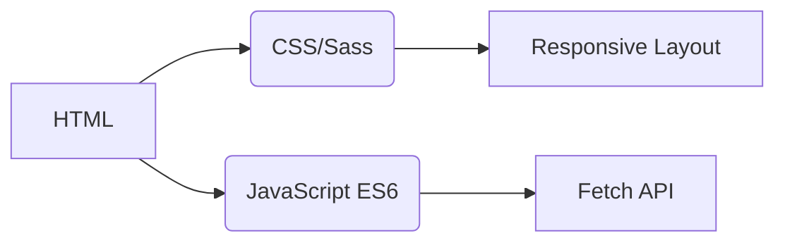
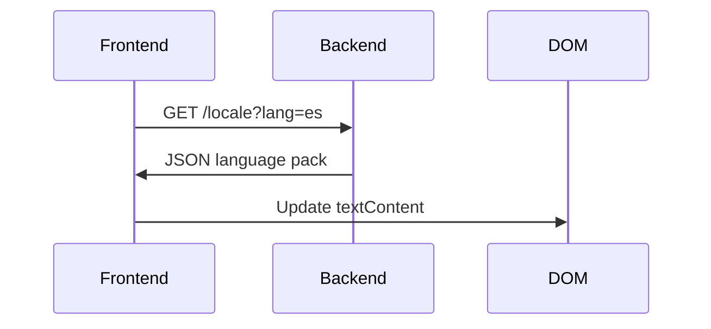
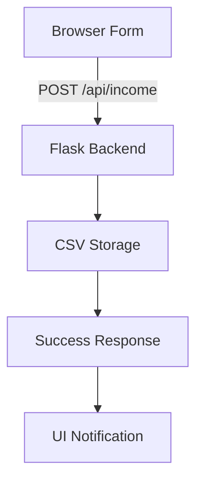

# Income Tracker
## Internationalization
The application supports **20 languages** with native-level localization. Translation files are available in the `/locales` directory:

- [Arabic (العربية)](ar.md)
- [Chinese (文言)](zh.md)
- [Dutch (Nederlands)](nl.md)
- **[English](README.md)** (Primary documentation)
- [French (Français)](fr.md)
- [German (Deutsch)](de.md)
- [Hindi (हिन्दी)](hi.md)
- [Indonesian (Bahasa Indonesia)](id.md)
- [Italian (Italiano)](it.md)
- [Japanese (日本語)](ja.md)
- [Korean (한국어)](ko.md)
- [Polish (Polski)](pl.md)
- [Portuguese (Português)](pt.md)
- [Russian (Русский)](ru.md)
- [Spanish (Español)](es.md)
- [Swedish (Svenska)](sv.md)
- [Thai (ไทย)](th.md)
- [Turkish (Türkçe)](tr.md)
- [Ukrainian (Українська)](uk.md)
- [Vietnamese (Tiếng Việt)](vi.md)

---

# Income Tracking System

## Project Overview
A multi-language financial tracking application with CSV data storage and adaptive UI. The system provides:

- Real-time income recording
- Global language support
- Persistent data management
- Theme customization
- Mobile-responsive design

## Key Features
| Feature | Description | Technology |
|---------|-------------|------------|
| **Income Recording** | Add, view, and manage financial entries | HTML Form + CSV |
| **Multilingual UI** | 20 languages with native localization | JSON i18n |
| **Data Persistence** | Secure storage of financial records | CSV Files |
| **Dark/Light Mode** | Adaptive theme switching | CSS Variables |
| **Responsive Design** | Optimized for all device sizes | CSS Media Queries |
| **User Preferences** | Remembered language and theme settings | LocalStorage |

---

## Technology Stack
**Frontend**  


**Backend**  
```mermaid
graph LR
F[Python Flask] --> G[CSV Data Handling]
F --> H[RESTful API]
H --> I[/api/income]
```

**Data Management**  
- CSV-based storage (no database required)
- Automatic file creation
- UTF-8 encoding support

---

## Installation & Setup
```bash
# 1. Install dependencies
pip install flask flask-cors

# 2. Start the application
python server.py

# 3. Access the system
http://localhost:5000
```

**Configuration Options**  
- Change port: `export FLASK_PORT=8080`
- Set default language: `DEFAULT_LANG=es`

---

## Technical Documentation

### Internationalization Implementation
**File Structure**  
```
/locales
  ├── en.json    # English
  ├── zh.json    # Chinese
  └── ...        # 18 other languages
```

**Implementation Workflow**  


### Data Flow Architecture


### Core System Components
#### 1. Data Presentation
- REST endpoint: `GET /api/income`
- Dynamic table generation
- Mobile-optimized card layout (screens < 768px)

#### 2. Theme Management
```javascript
// Theme switching logic
function toggleTheme() {
  const isDark = document.body.classList.toggle('dark-mode');
  localStorage.setItem('theme', isDark ? 'dark' : 'light');
}

// Initialize from preferences
const savedTheme = localStorage.getItem('theme') || 
                   (matchMedia('(prefers-color-scheme: dark)').matches ? 'dark' : 'light');
document.body.classList.toggle('dark-mode', savedTheme === 'dark');
```

#### 3. Responsive Design
**Breakpoint Strategy**  
```css
/* Mobile-first default */
.table-row { display: block; }

/* Tablet+ adaptation */
@media (min-width: 768px) {
  .table-row { display: table-row; }
}
```

---

## Project Structure
```
├── index.html               # Application entry point
├── styles.css               # Global styles with theme variables
├── app.js                   # Core application logic
├── locales/                 # Language resource files
│   ├── ar.json              # Arabic translations
│   ├── zh.json              # Classical Chinese translations
│   └── ...                  # 18 additional languages
├── data/                    # Persistent storage
│   └── income.csv           # Financial records (auto-created)
├── server.py                # Flask API server
└── docs/                    # Localized documentation
    ├── README.md            # English documentation
    ├── ar.md                # Arabic documentation
    └── ...                  # 18 language-specific docs
```

---

## Development Guide
### Adding New Languages
1. Create `[lang-code].json` in `/locales`
2. Add corresponding `[lang-code].md` in `/docs`
3. Register in `app.js` language selector:
```javascript
const LANGUAGES = {
  'en': 'English',
  'zh': '中文（文言）',
  // ... other languages
};
```

### Extending Functionality
**Suggested Improvements**:
1. Expense tracking module
2. Data visualization dashboard
3. Multi-user support
4. Cloud storage integration

---

> **System Requirements**: Python 3.8+, Modern Browser (Chrome 88+, Firefox 84+, Safari 14+)  
> **License**: MIT Open Source  
> **Contributing**: See CONTRIBUTING.md for guidelines
```