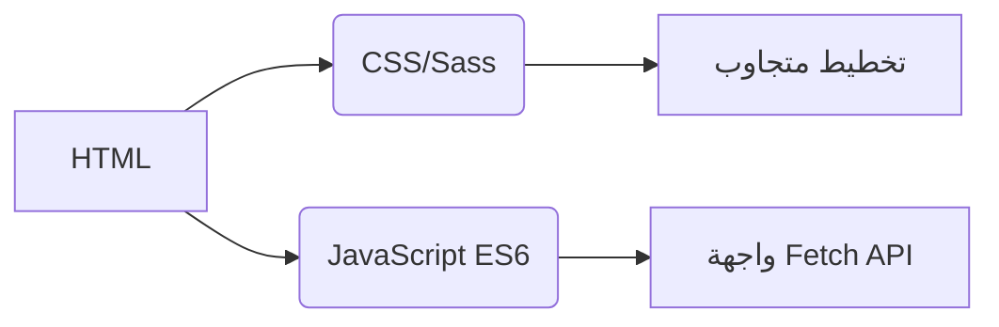
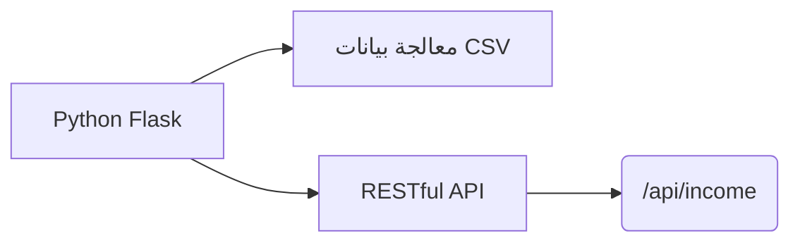
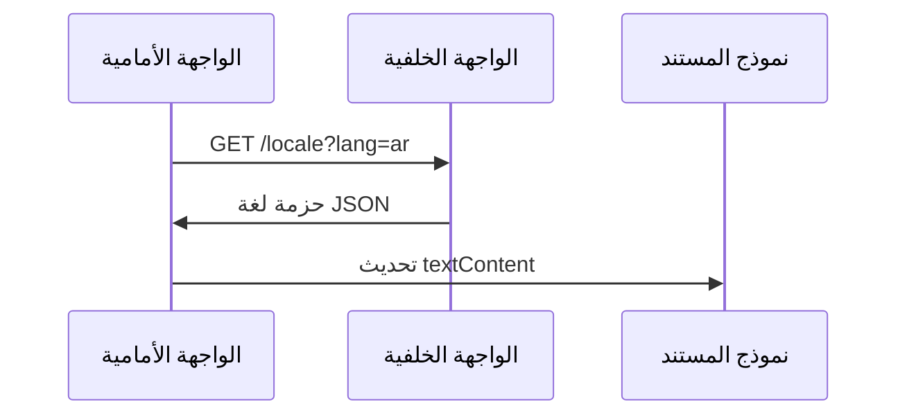
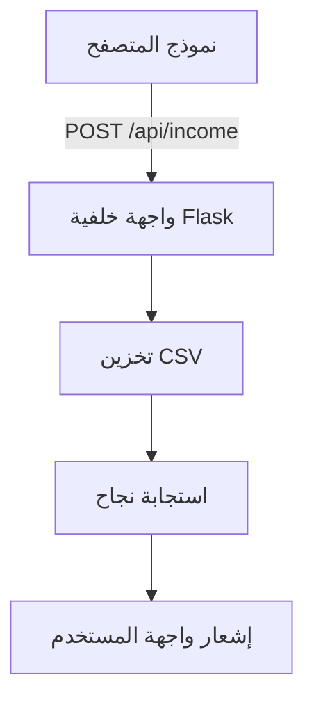

<arabic>
# متعقب الدخل
## التدويل  
يدعم التطبيق **20 لغة** مع توطين بمستوى اللغة الأم. ملفات الترجمة متاحة في دليل `/locales`:

- [العربية](ar.md)
- [الصينية (الكلاسيكية)](zh.md)
- [الهولندية](nl.md)
- [الإنجليزية](README.md) (الوثائق الأساسية)
- [الفرنسية](fr.md)
- [الألمانية](de.md)
- [الهندية](hi.md)
- [الإندونيسية](id.md)
- [الإيطالية](it.md)
- [اليابانية](ja.md)
- [الكورية](ko.md)
- [البولندية](pl.md)
- [البرتغالية](pt.md)
- [الروسية](ru.md)
- [الإسبانية](es.md)
- [السويدية](sv.md)
- [التايلاندية](th.md)
- [التركية](tr.md)
- [الأوكرانية](uk.md)
- [الفيتنامية](vi.md)

---

# نظام تتبع الدخل

## نظرة عامة على المشروع  
تطبيق مالي متعدد اللغات مع تخزين بيانات CSV وواجهة مستخدم تكيفية. يوفر النظام:

- تسجيل الدخل في الوقت الفعلي
- دعم لغوي عالمي
- إدارة بيانات دائمة
- تخصيص السمة
- تصميم متجاوب للجوال

## الميزات الرئيسية  
| الميزة | الوصف | التقنية |
|---------|-------------|------------|
| **تسجيل الدخل** | إضافة وعرض وإدارة الإدخالات المالية | نموذج HTML + CSV |
| **واجهة متعددة اللغات** | 20 لغة مع توطين أصلي | JSON i18n |
| **استمرارية البيانات** | تخزين آمن للسجلات المالية | ملفات CSV |
| **الوضع الداكن/الفاتح** | تبديل سمة تكيفية | متغيرات CSS |
| **تصميم متجاوب** | مُحسّن لجميع أحجام الأجهزة | استعلامات CSS الإعلامية |
| **تفضيلات المستخدم** | تذكر إعدادات اللغة والسمة | LocalStorage |

---

## حزمة التقنيات  
**واجهة المستخدم الأمامية**  


**واجهة المستخدم الخلفية**  


**إدارة البيانات**  
- تخزين يعتمد على CSV (لا حاجة لقاعدة بيانات)
- إنشاء ملف تلقائي
- دعم ترميز UTF-8

---

## التثبيت والإعداد  
```bash
# 1. تثبيت التبعيات
pip install flask flask-cors

# 2. تشغيل التطبيق
python server.py

# 3. الوصول إلى النظام
http://localhost:5000
```

**خيارات التكوين**  
- تغيير المنفذ: `export FLASK_PORT=8080`
- تعيين اللغة الافتراضية: `DEFAULT_LANG=es`

---

## الوثائق الفنية

### تنفيذ التدويل  
**هيكل الملفات**  
```
/locales
  ├── en.json    # الإنجليزية
  ├── ar.json    # العربية
  └── ...        # 18 لغة أخرى
```

**سير عمل التنفيذ**  


### بنية تدفق البيانات  


### مكونات النظام الأساسية  
#### 1. عرض البيانات  
- نقطة نهاية REST: `GET /api/income`
- إنشاء جدول ديناميكي
- تخطيط بطاقة محسّن للجوال (شاشات < 768 بكسل)

#### 2. إدارة السمة  
```javascript
// منطق تبديل السمة
function toggleTheme() {
  const isDark = document.body.classList.toggle('dark-mode');
  localStorage.setItem('theme', isDark ? 'dark' : 'light');
}

// التهيئة من التفضيلات
const savedTheme = localStorage.getItem('theme') || 
                   (matchMedia('(prefers-color-scheme: dark)').matches ? 'dark' : 'light');
document.body.classList.toggle('dark-mode', savedTheme === 'dark');
```

#### 3. التصميم المتجاوب  
**استراتيجية نقطة التوقف**  
```css
/* الأساس للأجهزة المحمولة */
.table-row { display: block; }

/* تكييف للتابلت+ */
@media (min-width: 768px) {
  .table-row { display: table-row; }
}
```

---

## هيكل المشروع  
```
├── index.html               # نقطة دخول التطبيق
├── styles.css               # الأنماط العامة مع متغيرات السمة
├── app.js                   # منطق التطبيق الأساسي
├── locales/                 # ملفات موارد اللغة
│   ├── en.json              # ترجمات الإنجليزية
│   ├── ar.json              # ترجمات العربية
│   └── ...                  # 18 لغة إضافية
├── data/                    # تخزين دائم
│   └── income.csv           # السجلات المالية (تنشئ تلقائياً)
├── server.py                # خادم Flask API
└── docs/                    # وثائق مترجمة
    ├── README.md            # الوثائق الإنجليزية
    ├── ar.md                # الوثائق العربية
    └── ...                  # وثائق بـ 18 لغة
```

---

## دليل التطوير  
### إضافة لغات جديدة  
1. إنشاء `[كود-اللغة].json` في `/locales`
2. إضافة `[كود-اللغة].md` المقابل في `/docs`
3. التسجيل في محدد لغة `app.js`:
```javascript
const LANGUAGES = {
  'en': 'الإنجليزية',
  'ar': 'العربية',
  // ... لغات أخرى
};
```

### توسيع الوظائف  
**تحسينات مقترحة**:  
1. وحدة تتبع النفقات  
2. لوحة تحكم لتصور البيانات  
3. دعم متعدد المستخدمين  
4. تكامل مع التخزين السحابي  

---
> **متطلبات النظام**: Python 3.8+، متصفح حديث (Chrome 88+, Firefox 84+, Safari 14+)  
> **الترخيص**: مفتوح المصدر AGPL-3.0  
> **المساهمة**: راجع CONTRIBUTING.md للإرشادات  
</arabic>