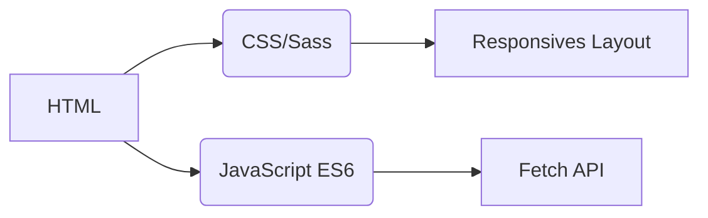
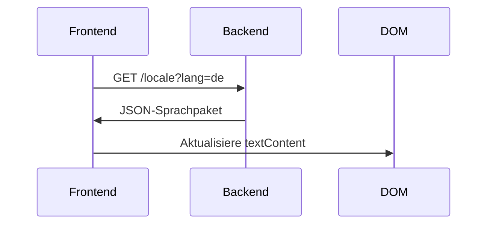
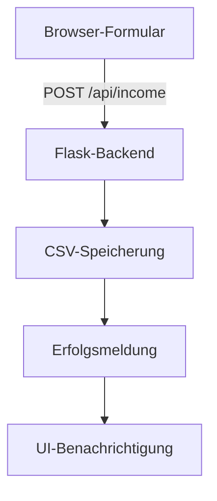

# Einkommens-Tracker
## Internationalisierung  
Die Anwendung unterstützt **20 Sprachen** mit nativer Lokalisierung. Übersetzungsdateien sind im Verzeichnis `/locales` verfügbar:

- [Arabisch (العربية)](ar.md)  
- [Chinesisch (Klassisch)](zh.md)  
- [Niederländisch](nl.md)  
- [Englisch](README.md) (Primärdokumentation)  
- [Französisch](fr.md)  
- **[Deutsch](de.md)**  
- [Hindi (हिन्दी)](hi.md)  
- [Indonesisch](id.md)  
- [Italienisch](it.md)  
- [Japanisch](ja.md)  
- [Koreanisch](ko.md)  
- [Polnisch](pl.md)  
- [Portugiesisch](pt.md)  
- [Russisch](ru.md)  
- [Spanisch](es.md)  
- [Schwedisch](sv.md)  
- [Thailändisch](th.md)  
- [Türkisch](tr.md)  
- [Ukrainisch](uk.md)  
- [Vietnamesisch](vi.md)  

---

# Einkommensverfolgungssystem

## Projektübersicht  
Eine mehrsprachige Finanztracking-Anwendung mit CSV-Datenspeicherung und adaptiver Benutzeroberfläche. Das System bietet:

- Echtzeit-Einkommenserfassung
- Globale Sprachunterstützung
- Persistente Datenverwaltung
- Themenanpassung
- Mobiloptimiertes Design

## Hauptfunktionen  
| Funktion | Beschreibung | Technologie |
|---------|-------------|------------|
| **Einkommenserfassung** | Finanzdaten hinzufügen, anzeigen und verwalten | HTML-Formular + CSV |
| **Mehrsprachige Oberfläche** | 20 Sprachen mit nativer Lokalisierung | JSON i18n |
| **Datenpersistenz** | Sichere Speicherung finanzieller Aufzeichnungen | CSV-Dateien |
| **Dunkler/Heller Modus** | Adaptiver Themenwechsel | CSS-Variablen |
| **Responsives Design** | Für alle Gerätegrößen optimiert | CSS Media Queries |
| **Benutzereinstellungen** | Gespeicherte Sprach- und Theme-Einstellungen | LocalStorage |

---

## Technologie-Stack  
**Frontend**  


**Backend**  
```mermaid
graph LR
F[Python Flask] --> G[CSV-Datenverarbeitung]
F --> H[RESTful API]
H --> I[/api/income]
```

**Datenverwaltung**  
- CSV-basierte Speicherung (keine Datenbank benötigt)
- Automatische Dateierstellung
- UTF-8-Kodierungsunterstützung

---

## Installation & Einrichtung  
```bash
# 1. Abhängigkeiten installieren
pip install flask flask-cors

# 2. Anwendung starten
python server.py

# 3. System aufrufen
http://localhost:5000
```

**Konfigurationsoptionen**  
- Port ändern: `export FLASK_PORT=8080`
- Standardsprache festlegen: `DEFAULT_LANG=es`

---

## Technische Dokumentation

### Implementierung der Internationalisierung  
**Dateistruktur**  
```
/locales
  ├── en.json    # Englisch
  ├── de.json    # Deutsch
  └── ...        # 18 weitere Sprachen
```

**Implementierungs-Workflow**  


### Datenfluss-Architektur  


### Kernsystemkomponenten  
#### 1. Datenpräsentation  
- REST-Endpunkt: `GET /api/income`
- Dynamische Tabellengenerierung
- Mobiloptimierte Kartenansicht (Bildschirme < 768px)

#### 2. Themenverwaltung  
```javascript
// Themenwechsel-Logik
function themaWechseln() {
  const istDunkel = document.body.classList.toggle('dunkel-modus');
  localStorage.setItem('thema', istDunkel ? 'dunkel' : 'hell');
}

// Initialisierung von Einstellungen
const gespeichertesThema = localStorage.getItem('thema') || 
                   (matchMedia('(prefers-color-scheme: dark)').matches ? 'dunkel' : 'hell');
document.body.classList.toggle('dunkel-modus', gespeichertesThema === 'dunkel');
```

#### 3. Responsives Design  
**Breakpoint-Strategie**  
```css
/* Mobile-First Standard */
.tabellen-reihe { display: block; }

/* Tablet+-Anpassung */
@media (min-width: 768px) {
  .tabellen-reihe { display: table-row; }
}
```

---

## Projektstruktur  
```
├── index.html               # Anwendungseinstiegspunkt
├── styles.css               # Globale Styles mit Themenvariablen
├── app.js                   # Kernanwendungslogik
├── locales/                 # Sprachressourcendateien
│   ├── en.json              # Englische Übersetzungen
│   ├── de.json              # Deutsche Übersetzungen
│   └── ...                  # 18 weitere Sprachen
├── data/                    # Persistenter Speicher
│   └── income.csv           # Finanzaufzeichnungen (automatisch erstellt)
├── server.py                # Flask-API-Server
└── docs/                    # Lokalisierte Dokumentation
    ├── README.md            # Englische Dokumentation
    ├── de.md                # Deutsche Dokumentation
    └── ...                  # Dokumentation in 18 Sprachen
```

---

## Entwicklungsleitfaden  
### Neue Sprachen hinzufügen  
1. Erstelle `[sprachcode].json` in `/locales`
2. Füge entsprechende `[sprachcode].md` in `/docs` hinzu
3. Registriere in `app.js` Sprachauswahl:
```javascript
const SPRACHEN = {
  'en': 'Englisch',
  'de': 'Deutsch',
  // ... weitere Sprachen
};
```

### Funktionalität erweitern  
**Vorgeschlagene Verbesserungen**:  
1. Ausgabenverfolgungsmodul  
2. Datenvisualisierungs-Dashboard  
3. Mehrbenutzerunterstützung  
4. Cloud-Speicher-Integration  

---
> **Systemanforderungen**: Python 3.8+, Moderner Browser (Chrome 88+, Firefox 84+, Safari 14+)  
> **Lizenz**: MIT Open Source  
> **Mitwirkung**: Siehe CONTRIBUTING.md für Richtlinien  