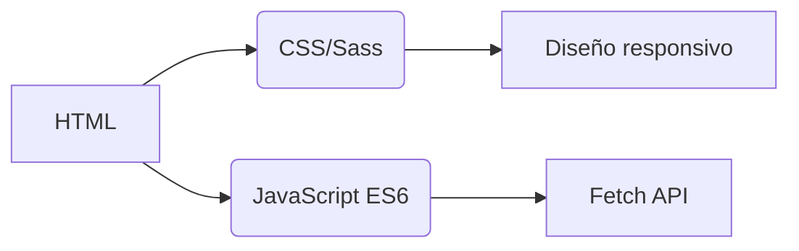
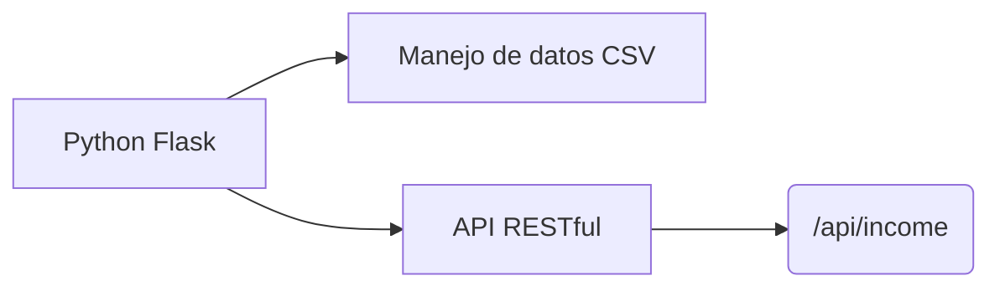
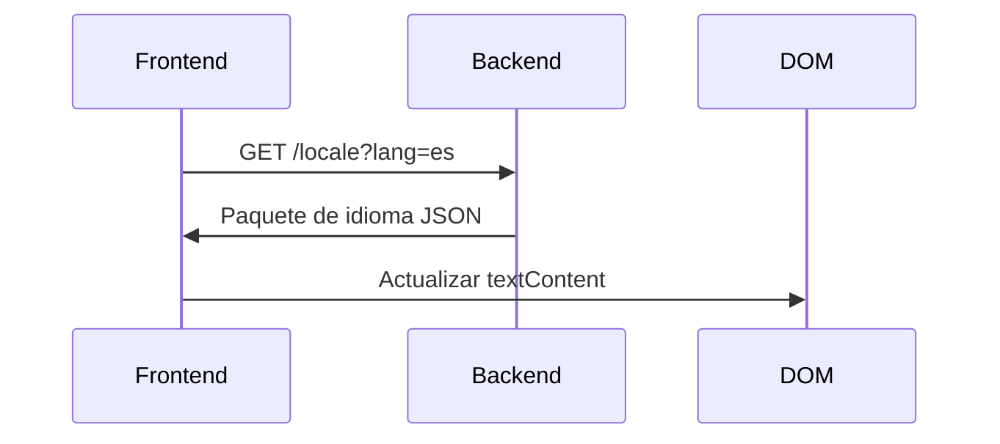
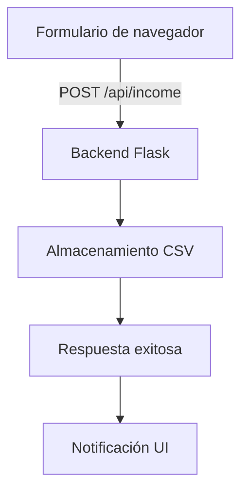

# Seguidor de Ingresos
## Internacionalización  
La aplicación soporta **20 idiomas** con localización de nivel nativo. Los archivos de traducción están disponibles en el directorio `/locales`:

- [Árabe (العربية)](ar.md)  
- [Chino Clásico (文言)](zh.md)  
- [Neerlandés](nl.md)  
- [Inglés](README.md) (Documentación principal)  
- [Francés](fr.md)  
- [Alemán](de.md)  
- [Hindi](hi.md)  
- [Indonesio](id.md)  
- [Italiano](it.md)  
- [Japonés](ja.md)  
- [Coreano](ko.md)  
- [Polaco](pl.md)  
- [Portugués](pt.md)  
- [Ruso](ru.md)  
- **[Español](es.md)**  
- [Sueco](sv.md)  
- [Tailandés](th.md)  
- [Turco](tr.md)  
- [Ucraniano](uk.md)  
- [Vietnamita](vi.md)  

---

# Sistema de Seguimiento de Ingresos

## Resumen del Proyecto  
Aplicación financiera multilingüe con almacenamiento de datos CSV e interfaz adaptativa. El sistema ofrece:

- Registro de ingresos en tiempo real
- Soporte lingüístico global
- Gestión persistente de datos
- Personalización de temas
- Diseño responsivo para móviles

## Características Clave  
| Función | Descripción | Tecnología |
|---------|-------------|------------|
| **Registro de ingresos** | Añadir, ver y gestionar entradas financieras | Formulario HTML + CSV |
| **Interfaz multilingüe** | 20 idiomas con localización nativa | JSON i18n |
| **Persistencia de datos** | Almacenamiento seguro de registros financieros | Archivos CSV |
| **Modo oscuro/claro** | Cambio de tema adaptable | Variables CSS |
| **Diseño responsivo** | Optimizado para todos los tamaños de dispositivos | Media Queries CSS |
| **Preferencias de usuario** | Configuración de idioma y tema recordada | LocalStorage |

---

## Stack Tecnológico  
**Frontend**  


**Backend**  


**Gestión de datos**  
- Almacenamiento basado en CSV (no requiere base de datos)
- Creación automática de archivos
- Soporte para codificación UTF-8

---

## Instalación y Configuración  
```bash
# 1. Instalar dependencias
pip install flask flask-cors

# 2. Iniciar aplicación
python server.py

# 3. Acceder al sistema
http://localhost:5000
```

**Opciones de configuración**  
- Cambiar puerto: `export FLASK_PORT=8080`
- Establecer idioma predeterminado: `DEFAULT_LANG=es`

---

## Documentación Técnica

### Implementación de internacionalización  
**Estructura de archivos**  
```
/locales
  ├── en.json    # Inglés
  ├── es.json    # Español
  └── ...        # 18 otros idiomas
```

**Flujo de implementación**  


### Arquitectura de flujo de datos  


### Componentes principales del sistema  
#### 1. Presentación de datos  
- Punto final REST: `GET /api/income`
- Generación dinámica de tablas
- Diseño de tarjetas optimizado para móvil (pantallas < 768px)

#### 2. Gestión de temas  
```javascript
// Lógica de cambio de tema
function cambiarTema() {
  const esOscuro = document.body.classList.toggle('modo-oscuro');
  localStorage.setItem('tema', esOscuro ? 'oscuro' : 'claro');
}

// Inicializar desde preferencias
const temaGuardado = localStorage.getItem('tema') || 
                   (matchMedia('(prefers-color-scheme: dark)').matches ? 'oscuro' : 'claro');
document.body.classList.toggle('modo-oscuro', temaGuardado === 'oscuro');
```

#### 3. Diseño responsivo  
**Estrategia de puntos de ruptura**  
```css
/* Enfoque mobile-first */
.fila-tabla { display: block; }

/* Adaptación para tablet+ */
@media (min-width: 768px) {
  .fila-tabla { display: table-row; }
}
```

---

## Estructura del Proyecto  
```
├── index.html               # Punto de entrada de la aplicación
├── styles.css               # Estilos globales con variables de tema
├── app.js                   # Lógica principal de la aplicación
├── locales/                 # Archivos de recursos de idioma
│   ├── en.json              # Traducciones en inglés
│   ├── es.json              # Traducciones en español
│   └── ...                  # 18 idiomas adicionales
├── data/                    # Almacenamiento persistente
│   └── income.csv           # Registros financieros (creado automáticamente)
├── server.py                # Servidor API Flask
└── docs/                    # Documentación localizada
    ├── README.md            # Documentación en inglés
    ├── es.md                # Documentación en español
    └── ...                  # Documentos para 18 idiomas
```

---

## Guía de Desarrollo  
### Añadir nuevos idiomas  
1. Crear `[código-idioma].json` en `/locales`
2. Añadir `[código-idioma].md` correspondiente en `/docs`
3. Registrar en selector de idioma `app.js`:
```javascript
const IDIOMAS = {
  'en': 'Inglés',
  'es': 'Español',
  // ... otros idiomas
};
```

### Ampliar funcionalidad  
**Mejoras sugeridas**:  
1. Módulo de seguimiento de gastos  
2. Panel de visualización de datos  
3. Soporte multiusuario  
4. Integración con almacenamiento en la nube  

---
> **Requisitos del sistema**: Python 3.8+, Navegador moderno (Chrome 88+, Firefox 84+, Safari 14+)  
> **Licencia**: AGPL-3.0 Open Source  
> **Contribuciones**: Ver CONTRIBUTING.md para pautas  