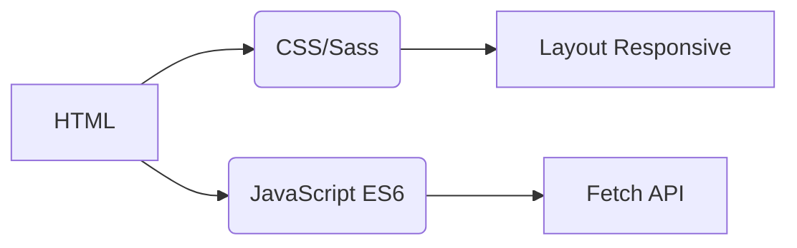
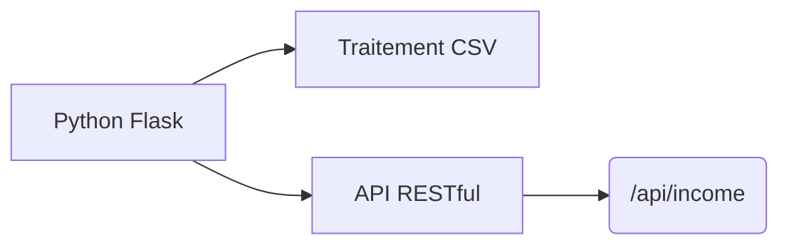
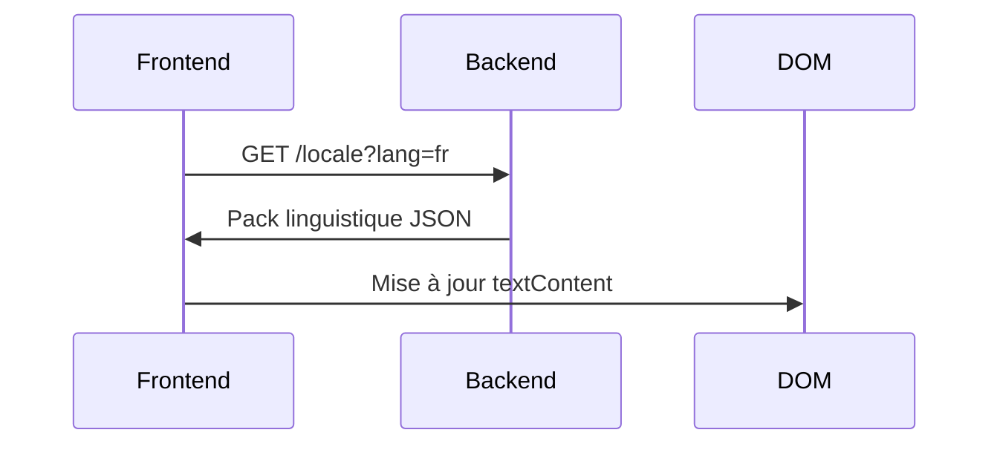
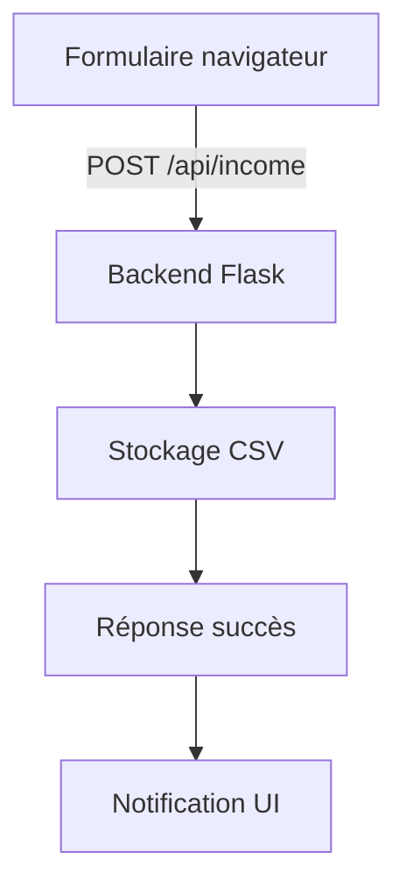

# Suivi des Revenus
## Internationalisation  
L'application prend en charge **20 langues** avec une localisation de niveau natif. Les fichiers de traduction sont disponibles dans le répertoire `/locales` :

- [Arabe (العربية)](ar.md)  
- [Chinois classique (文言)](zh.md)  
- [Néerlandais (Nederlands)](nl.md)  
- [Anglais](README.md) (Documentation principale)  
- **[Français](fr.md)**  
- [Allemand (Deutsch)](de.md)  
- [Hindi (हिन्दी)](hi.md)  
- [Indonésien (Bahasa Indonesia)](id.md)  
- [Italien (Italiano)](it.md)  
- [Japonais (日本語)](ja.md)  
- [Coréen (한국어)](ko.md)  
- [Polonais (Polski)](pl.md)  
- [Portugais (Português)](pt.md)  
- [Russe (Русский)](ru.md)  
- [Espagnol (Español)](es.md)  
- [Suédois (Svenska)](sv.md)  
- [Thaï (ไทย)](th.md)  
- [Turc (Türkçe)](tr.md)  
- [Ukrainien (Українська)](uk.md)  
- [Vietnamien (Tiếng Việt)](vi.md)  

---

# Système de Suivi des Revenus

## Aperçu du Projet  
Application financière multilingue avec stockage de données CSV et interface adaptative. Le système offre :

- Enregistrement des revenus en temps réel
- Support linguistique mondial
- Gestion persistante des données
- Personnalisation du thème
- Conception responsive pour mobiles

## Fonctionnalités Clés  
| Fonctionnalité | Description | Technologie |
|---------|-------------|------------|
| **Enregistrement des revenus** | Ajouter, consulter et gérer les entrées financières | Formulaire HTML + CSV |
| **Interface multilingue** | 20 langues avec localisation native | i18n JSON |
| **Persistance des données** | Stockage sécurisé des enregistrements financiers | Fichiers CSV |
| **Mode Sombre/Clair** | Changement de thème adaptatif | Variables CSS |
| **Design Responsive** | Optimisé pour toutes tailles d'appareils | Media Queries CSS |
| **Préférences utilisateur** | Mémorisation des paramètres de langue et thème | LocalStorage |

---

## Stack Technologique  
**Frontend**  


**Backend**  


**Gestion des données**  
- Stockage basé sur CSV (base de données non requise)
- Création automatique de fichiers
- Support de l'encodage UTF-8

---

## Installation & Configuration  
```bash
# 1. Installer les dépendances
pip install flask flask-cors

# 2. Démarrer l'application
python server.py

# 3. Accéder au système
http://localhost:5000
```

**Options de configuration**  
- Changer le port : `export FLASK_PORT=8080`
- Définir la langue par défaut : `DEFAULT_LANG=es`

---

## Documentation Technique

### Mise en œuvre de l'internationalisation  
**Structure des fichiers**  
```
/locales
  ├── en.json    # Anglais
  ├── fr.json    # Français
  └── ...        # 18 autres langues
```

**Workflow d'implémentation**  


### Architecture du flux de données  


### Composants principaux  
#### 1. Présentation des données  
- Point de terminaison REST : `GET /api/income`
- Génération dynamique de tableaux
- Disposition cartes optimisée mobile (< 768px)

#### 2. Gestion des thèmes  
```javascript
// Logique de changement de thème
function toggleTheme() {
  const isDark = document.body.classList.toggle('dark-mode');
  localStorage.setItem('theme', isDark ? 'dark' : 'light');
}

// Initialisation depuis préférences
const savedTheme = localStorage.getItem('theme') || 
                   (matchMedia('(prefers-color-scheme: dark)').matches ? 'dark' : 'light');
document.body.classList.toggle('dark-mode', savedTheme === 'dark');
```

#### 3. Design Responsive  
**Stratégie de points de rupture**  
```css
/* Priorité mobile */
.table-row { display: block; }

/* Adaptation tablette+ */
@media (min-width: 768px) {
  .table-row { display: table-row; }
}
```

---

## Structure du Projet  
```
├── index.html               # Point d'entrée
├── styles.css               # Styles globaux + variables
├── app.js                   # Logique principale
├── locales/                 # Fichiers linguistiques
│   ├── en.json              # Traductions anglaises
│   ├── fr.json              # Traductions françaises
│   └── ...                  # 18 autres langues
├── data/                    # Stockage persistant
│   └── income.csv           # Enregistrements financiers (auto-créé)
├── server.py                # Serveur API Flask
└── docs/                    # Documentation localisée
    ├── README.md            # Documentation anglaise
    ├── fr.md                # Documentation française
    └── ...                  # Docs pour 18 langues
```

---

## Guide de Développement  
### Ajouter de nouvelles langues  
1. Créer `[code-langue].json` dans `/locales`
2. Ajouter `[code-langue].md` correspondant dans `/docs`
3. Enregistrer dans le sélecteur de langue `app.js` :
```javascript
const LANGUAGES = {
  'en': 'Anglais',
  'fr': 'Français',
  // ... autres langues
};
```

### Étendre les fonctionnalités  
**Améliorations suggérées** :  
1. Module de suivi des dépenses  
2. Tableau de bord de visualisation  
3. Support multi-utilisateurs  
4. Intégration cloud  

---
> **Configuration requise** : Python 3.8+, Navigateur moderne (Chrome 88+, Firefox 84+, Safari 14+)  
> **Licence** : AGPL-3.0 Open Source  
> **Contribution** : Voir CONTRIBUTING.md pour directives  