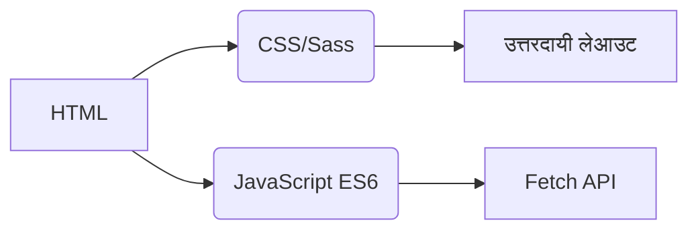
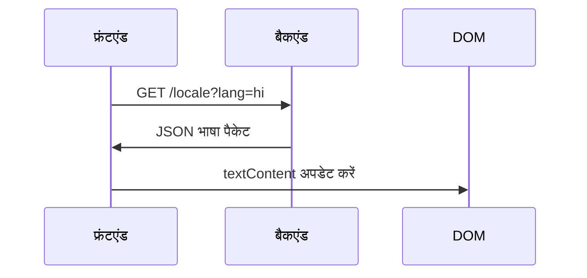
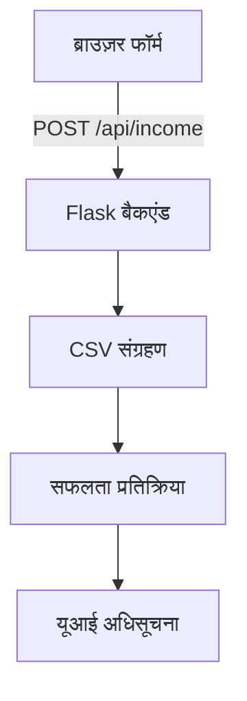

# आय ट्रैकर
## अंतर्राष्ट्रीयकरण  
यह एप्लिकेशन **20 भाषाओं** को मूल-स्तर के स्थानीयकरण के साथ समर्थित करता है। अनुवाद फ़ाइलें `/locales` निर्देशिका में उपलब्ध हैं:

- [अरबी (العربية)](ar.md)  
- [चीनी (क्लासिकल)](zh.md)  
- [डच (Nederlands)](nl.md)  
- [अंग्रेज़ी](README.md) (प्राथमिक दस्तावेज़)  
- [फ़्रेंच (Français)](fr.md)  
- [जर्मन (Deutsch)](de.md)  
- **[हिंदी](hi.md)**  
- [इंडोनेशियाई (Bahasa Indonesia)](id.md)  
- [इतालवी (Italiano)](it.md)  
- [जापानी (日本語)](ja.md)  
- [कोरियाई (한국어)](ko.md)  
- [पोलिश (Polski)](pl.md)  
- [पुर्तगाली (Português)](pt.md)  
- [रूसी (Русский)](ru.md)  
- [स्पेनिश (Español)](es.md)  
- [स्वीडिश (Svenska)](sv.md)  
- [थाई (ไทย)](th.md)  
- [तुर्की (Türkçe)](tr.md)  
- [यूक्रेनियन (Українська)](uk.md)  
- [वियतनामी (Tiếng Việt)](vi.md)  

---

# आय ट्रैकिंग प्रणाली

## परियोजना अवलोकन  
सीएसवी डेटा संग्रहण और अनुकूली यूआई के साथ एक बहुभाषी वित्तीय ट्रैकिंग एप्लिकेशन। सिस्टम प्रदान करता है:

- रियल-टाइम आय रिकॉर्डिंग
- वैश्विक भाषा समर्थन
- स्थायी डेटा प्रबंधन
- थीम अनुकूलन
- मोबाइल-अनुकूल डिज़ाइन

## मुख्य विशेषताएं  
| सुविधा | विवरण | प्रौद्योगिकी |
|---------|-------------|------------|
| **आय रिकॉर्डिंग** | वित्तीय प्रविष्टियाँ जोड़ें, देखें और प्रबंधित करें | HTML फॉर्म + CSV |
| **बहुभाषी यूआई** | 20 भाषाएं मूल स्थानीयकरण के साथ | JSON i18n |
| **डेटा दृढ़ता** | वित्तीय रिकॉर्ड का सुरक्षित भंडारण | CSV फ़ाइलें |
| **डार्क/लाइट मोड** | अनुकूली थीम स्विचिंग | CSS वेरिएबल्स |
| **उत्तरदायी डिजाइन** | सभी डिवाइस आकारों के लिए अनुकूलित | CSS मीडिया क्वेरीज़ |
| **उपयोगकर्ता प्राथमिकताएं** | याद रखी गई भाषा और थीम सेटिंग्स | लोकलस्टोरेज |

---

## प्रौद्योगिकी स्टैक  
**फ्रंटएंड**  


**बैकएंड**  
```mermaid
graph LR
F[Python Flask] --> G[CSV डेटा हैंडलिंग]
F --> H[RESTful API]
H --> I[/api/income]
```

**डेटा प्रबंधन**  
- CSV-आधारित भंडारण (डेटाबेस की आवश्यकता नहीं)
- स्वचालित फ़ाइल निर्माण
- UTF-8 एन्कोडिंग समर्थन

---

## स्थापना और सेटअप  
```bash
# 1. निर्भरताएं स्थापित करें
pip install flask flask-cors

# 2. एप्लिकेशन शुरू करें
python server.py

# 3. सिस्टम एक्सेस करें
http://localhost:5000
```

**कॉन्फ़िगरेशन विकल्प**  
- पोर्ट बदलें: `export FLASK_PORT=8080`
- डिफ़ॉल्ट भाषा सेट करें: `DEFAULT_LANG=es`

---

## तकनीकी दस्तावेज़ीकरण

### अंतर्राष्ट्रीयकरण कार्यान्वयन  
**फ़ाइल संरचना**  
```
/locales
  ├── en.json    # अंग्रेज़ी
  ├── hi.json    # हिंदी
  └── ...        # 18 अन्य भाषाएं
```

**कार्यान्वयन वर्कफ़्लो**  


### डेटा फ़्लो आर्किटेक्चर  


### कोर सिस्टम घटक  
#### 1. डेटा प्रस्तुति  
- REST एंडपॉइंट: `GET /api/income`
- डायनामिक टेबल जनरेशन
- मोबाइल-अनुकूल कार्ड लेआउट (स्क्रीन < 768px)

#### 2. थीम प्रबंधन  
```javascript
// थीम स्विचिंग लॉजिक
function थीम_बदलें() {
  const डार्क_है = document.body.classList.toggle('डार्क-मोड');
  localStorage.setItem('थीम', डार्क_है ? 'डार्क' : 'लाइट');
}

// प्राथमिकताओं से इनिशियलाइज़ करें
const सहेजी_थीम = localStorage.getItem('थीम') || 
                   (matchMedia('(prefers-color-scheme: dark)').matches ? 'डार्क' : 'लाइट');
document.body.classList.toggle('डार्क-मोड', सहेजी_थीम === 'डार्क');
```

#### 3. उत्तरदायी डिज़ाइन  
**ब्रेकपॉइंट रणनीति**  
```css
/* मोबाइल-फर्स्ट डिफ़ॉल्ट */
.टेबल-पंक्ति { display: block; }

/* टैबलेट+ अनुकूलन */
@media (min-width: 768px) {
  .टेबल-पंक्ति { display: table-row; }
}
```

---

## परियोजना संरचना  
```
├── index.html               # एप्लिकेशन एंट्री पॉइंट
├── styles.css               # वैश्विक स्टाइल्स थीम वेरिएबल्स के साथ
├── app.js                   # कोर एप्लिकेशन लॉजिक
├── locales/                 # भाषा संसाधन फ़ाइलें
│   ├── en.json              # अंग्रेज़ी अनुवाद
│   ├── hi.json              # हिंदी अनुवाद
│   └── ...                  # 18 अतिरिक्त भाषाएं
├── data/                    # स्थायी भंडारण
│   └── income.csv           # वित्तीय रिकॉर्ड (स्वतः निर्मित)
├── server.py                # Flask API सर्वर
└── docs/                    # स्थानीयकृत दस्तावेज़ीकरण
    ├── README.md            # अंग्रेज़ी दस्तावेज़ीकरण
    ├── hi.md                # हिंदी दस्तावेज़ीकरण
    └── ...                  # 18 भाषा-विशिष्ट डॉक्स
```

---

## विकास गाइड  
### नई भाषाएँ जोड़ना  
1. `/locales` में `[भाषा-कोड].json` बनाएँ
2. `/docs` में संगत `[भाषा-कोड].md` जोड़ें
3. `app.js` भाषा चयनकर्ता में पंजीकृत करें:
```javascript
const भाषाएँ = {
  'en': 'अंग्रेज़ी',
  'hi': 'हिन्दी',
  // ... अन्य भाषाएँ
};
```

### कार्यक्षमता विस्तार  
**सुझाई गई सुधार**:  
1. व्यय ट्रैकिंग मॉड्यूल  
2. डेटा विज़ुअलाइज़ेशन डैशबोर्ड  
3. बहु-उपयोगकर्ता समर्थन  
4. क्लाउड स्टोरेज एकीकरण  

---
> **सिस्टम आवश्यकताएँ**: Python 3.8+, आधुनिक ब्राउज़र (Chrome 88+, Firefox 84+, Safari 14+)  
> **लाइसेंस**: MIT ओपन सोर्स  
> **योगदान**: दिशानिर्देशों के लिए CONTRIBUTING.md देखें  