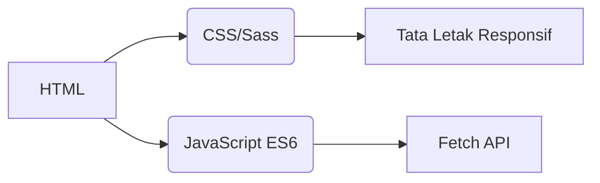
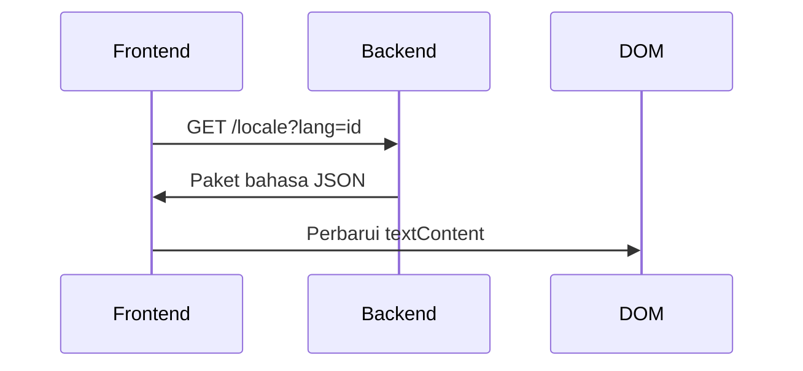
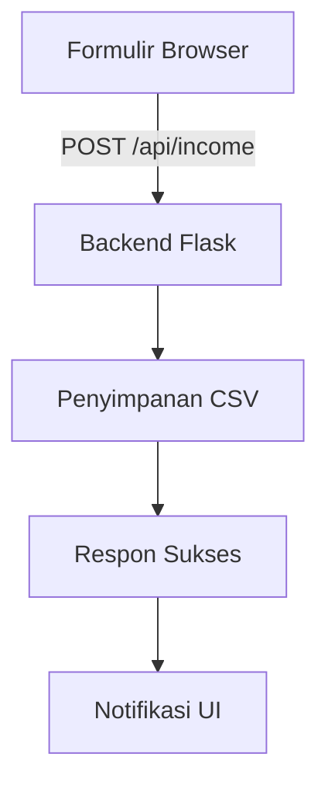

# Pelacak Pendapatan
## Internasionalisasi  
Aplikasi mendukung **20 bahasa** dengan pelokalan tingkat asli. File terjemahan tersedia di direktori `/locales`:

- [Arab (العربية)](ar.md)  
- [Tionghoa (Klasik)](zh.md)  
- [Belanda](nl.md)  
- [Inggris](README.md) (Dokumentasi utama)  
- [Prancis](fr.md)  
- [Jerman](de.md)  
- [Hindi](hi.md)  
- **[Indonesia](id.md)**  
- [Italia](it.md)  
- [Jepang](ja.md)  
- [Korea](ko.md)  
- [Polandia](pl.md)  
- [Portugis](pt.md)  
- [Rusia](ru.md)  
- [Spanyol](es.md)  
- [Swedia](sv.md)  
- [Thai](th.md)  
- [Turki](tr.md)  
- [Ukraina](uk.md)  
- [Vietnam](vi.md)  

---

# Sistem Pelacakan Pendapatan

## Gambaran Proyek  
Aplikasi pelacakan keuangan multibahasa dengan penyimpanan data CSV dan antarmuka adaptif. Sistem menyediakan:

- Pencatatan pendapatan real-time
- Dukungan bahasa global
- Manajemen data persisten
- Kustomisasi tema
- Desain responsif untuk perangkat seluler

## Fitur Utama  
| Fitur | Deskripsi | Teknologi |
|---------|-------------|------------|
| **Pencatatan Pendapatan** | Tambah, lihat, dan kelola entri keuangan | Formulir HTML + CSV |
| **Antarmuka Multibahasa** | 20 bahasa dengan pelokalan asli | JSON i18n |
| **Ketahanan Data** | Penyimpanan rekaman keuangan yang aman | File CSV |
| **Mode Gelap/Terang** | Pengalihan tema adaptif | Variabel CSS |
| **Desain Responsif** | Dioptimalkan untuk semua ukuran perangkat | Media Query CSS |
| **Preferensi Pengguna** | Pengaturan bahasa dan tema yang diingat | LocalStorage |

---

## Tumpukan Teknologi  
**Frontend**  


**Backend**  
```mermaid
graph LR
F[Python Flask] --> G[Penanganan Data CSV]
F --> H[API RESTful]
H --> I[/api/income]
```

**Manajemen Data**  
- Penyimpanan berbasis CSV (tidak perlu database)
- Pembuatan file otomatis
- Dukungan pengkodean UTF-8

---

## Instalasi & Pengaturan  
```bash
# 1. Pasang dependensi
pip install flask flask-cors

# 2. Mulai aplikasi
python server.py

# 3. Akses sistem
http://localhost:5000
```

**Opsi Konfigurasi**  
- Ubah port: `export FLASK_PORT=8080`
- Atur bahasa default: `DEFAULT_LANG=es`

---

## Dokumentasi Teknis

### Implementasi Internasionalisasi  
**Struktur File**  
```
/locales
  ├── en.json    # Inggris
  ├── id.json    # Indonesia
  └── ...        # 18 bahasa lainnya
```

**Alur Kerja Implementasi**  


### Arsitektur Aliran Data  


### Komponen Inti Sistem  
#### 1. Presentasi Data  
- Titik akhir REST: `GET /api/income`
- Pembuatan tabel dinamis
- Tata letak kartu dioptimalkan seluler (layar < 768px)

#### 2. Manajemen Tema  
```javascript
// Logika pengalihan tema
function toggleTheme() {
  const isDark = document.body.classList.toggle('dark-mode');
  localStorage.setItem('theme', isDark ? 'dark' : 'light');
}

// Inisialisasi dari preferensi
const savedTheme = localStorage.getItem('theme') || 
                   (matchMedia('(prefers-color-scheme: dark)').matches ? 'dark' : 'light');
document.body.classList.toggle('dark-mode', savedTheme === 'dark');
```

#### 3. Desain Responsif  
**Strategi Breakpoint**  
```css
/* Default mobile-first */
.table-row { display: block; }

/* Adaptasi tablet+ */
@media (min-width: 768px) {
  .table-row { display: table-row; }
}
```

---

## Struktur Proyek  
```
├── index.html               # Titik masuk aplikasi
├── styles.css               # Gaya global dengan variabel tema
├── app.js                   # Logika inti aplikasi
├── locales/                 # File sumber bahasa
│   ├── en.json              # Terjemahan Inggris
│   ├── id.json              # Terjemahan Indonesia
│   └── ...                  # 18 bahasa tambahan
├── data/                    # Penyimpanan persisten
│   └── income.csv           # Catatan keuangan (dibuat otomatis)
├── server.py                # Server API Flask
└── docs/                    # Dokumentasi terlokalisasi
    ├── README.md            # Dokumentasi Inggris
    ├── id.md                # Dokumentasi Indonesia
    └── ...                  # Dokumen untuk 18 bahasa
```

---

## Panduan Pengembangan  
### Menambahkan Bahasa Baru  
1. Buat `[kode-bahasa].json` di `/locales`
2. Tambahkan `[kode-bahasa].md` yang sesuai di `/docs`
3. Daftarkan di pemilih bahasa `app.js`:
```javascript
const BAHASA = {
  'en': 'Inggris',
  'id': 'Bahasa Indonesia',
  // ... bahasa lainnya
};
```

### Memperluas Fungsionalitas  
**Peningkatan yang Disarankan**:  
1. Modul pelacakan pengeluaran  
2. Dashboard visualisasi data  
3. Dukungan multi-pengguna  
4. Integrasi penyimpanan cloud  

---
> **Persyaratan Sistem**: Python 3.8+, Browser Modern (Chrome 88+, Firefox 84+, Safari 14+)  
> **Lisensi**: Sumber Terbuka MIT  
> **Kontribusi**: Lihat CONTRIBUTING.md untuk panduan  