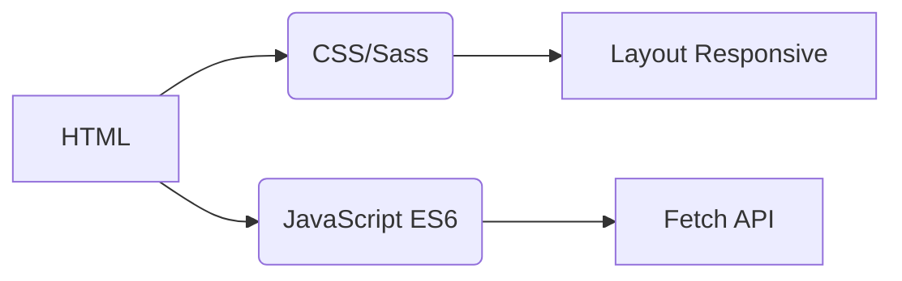
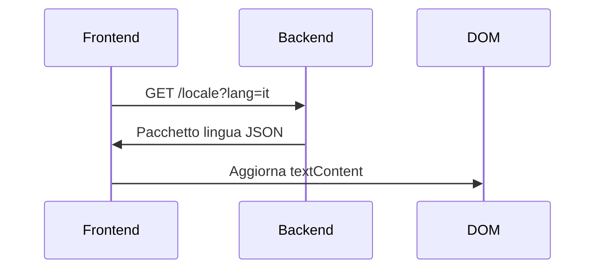
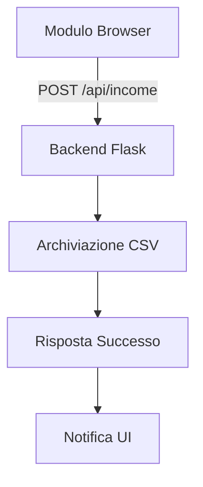

# Tracciatore di Reddito
## Internazionalizzazione  
L'applicazione supporta **20 lingue** con localizzazione di livello nativo. I file di traduzione sono disponibili nella directory `/locales`:

- [Arabo (العربية)](ar.md)  
- [Cinese (Classico)](zh.md)  
- [Olandese](nl.md)  
- [Inglese](README.md) (Documentazione primaria)  
- [Francese](fr.md)  
- [Tedesco](de.md)  
- [Hindi](hi.md)  
- [Indonesiano](id.md)  
- **[Italiano](it.md)**  
- [Giapponese](ja.md)  
- [Coreano](ko.md)  
- [Polacco](pl.md)  
- [Portoghese](pt.md)  
- [Russo](ru.md)  
- [Spagnolo](es.md)  
- [Svedese](sv.md)  
- [Tailandese](th.md)  
- [Turco](tr.md)  
- [Ucraino](uk.md)  
- [Vietnamita](vi.md)  

---

# Sistema di Tracciamento del Reddito

## Panoramica del Progetto  
Un'applicazione finanziaria multilingue con archiviazione dati CSV e interfaccia adattiva. Il sistema fornisce:

- Registrazione reddito in tempo reale
- Supporto linguistico globale
- Gestione dati persistente
- Personalizzazione del tema
- Design responsive per dispositivi mobili

## Caratteristiche Principali  
| Funzionalità | Descrizione | Tecnologia |
|---------|-------------|------------|
| **Registrazione Reddito** | Aggiungi, visualizza e gestisci voci finanziarie | Modulo HTML + CSV |
| **Interfaccia Multilingue** | 20 lingue con localizzazione nativa | JSON i18n |
| **Persistenza Dati** | Archiviazione sicura dei registri finanziari | File CSV |
| **Modalità Scura/Chiara** | Cambio tema adattivo | Variabili CSS |
| **Design Responsive** | Ottimizzato per tutte le dimensioni dei dispositivi | Media Query CSS |
| **Preferenze Utente** | Lingua e tema memorizzati | LocalStorage |

---

## Stack Tecnologico  
**Frontend**  


**Backend**  
```mermaid
graph LR
F[Python Flask] --> G[Gestione Dati CSV]
F --> H[API RESTful]
H --> I[/api/income]
```

**Gestione Dati**  
- Archiviazione basata su CSV (nessun database richiesto)
- Creazione automatica dei file
- Supporto codifica UTF-8

---

## Installazione & Configurazione  
```bash
# 1. Installa le dipendenze
pip install flask flask-cors

# 2. Avvia l'applicazione
python server.py

# 3. Accedi al sistema
http://localhost:5000
```

**Opzioni di Configurazione**  
- Cambia porta: `export FLASK_PORT=8080`
- Imposta lingua predefinita: `DEFAULT_LANG=es`

---

## Documentazione Tecnica

### Implementazione Internazionalizzazione  
**Struttura File**  
```
/locales
  ├── en.json    # Inglese
  ├── it.json    # Italiano
  └── ...        # 18 altre lingue
```

**Flusso di Implementazione**  


### Architettura Flusso Dati  


### Componenti Principali del Sistema  
#### 1. Presentazione Dati  
- Endpoint REST: `GET /api/income`
- Generazione tabella dinamica
- Layout a schede ottimizzato per mobile (schermi < 768px)

#### 2. Gestione Tema  
```javascript
// Logica cambio tema
function cambiaTema() {
  const isDark = document.body.classList.toggle('dark-mode');
  localStorage.setItem('theme', isDark ? 'dark' : 'light');
}

// Inizializza dalle preferenze
const temaSalvato = localStorage.getItem('theme') || 
                   (matchMedia('(prefers-color-scheme: dark)').matches ? 'dark' : 'light');
document.body.classList.toggle('dark-mode', temaSalvato === 'dark');
```

#### 3. Design Responsive  
**Strategia Breakpoint**  
```css
/* Default mobile-first */
.table-row { display: block; }

/* Adattamento tablet+ */
@media (min-width: 768px) {
  .table-row { display: table-row; }
}
```

---

## Struttura del Progetto  
```
├── index.html               # Punto di ingresso applicazione
├── styles.css               # Stili globali con variabili tema
├── app.js                   # Logica principale applicazione
├── locales/                 # File risorse linguistiche
│   ├── en.json              # Traduzioni inglesi
│   ├── it.json              # Traduzioni italiane
│   └── ...                  # 18 lingue aggiuntive
├── data/                    # Archiviazione persistente
│   └── income.csv           # Registri finanziari (creati automaticamente)
├── server.py                # Server API Flask
└── docs/                    # Documentazione localizzata
    ├── README.md            # Documentazione inglese
    ├── it.md                # Documentazione italiana
    └── ...                  # Documenti per 18 lingue
```

---

## Guida allo Sviluppo  
### Aggiungere Nuove Lingue  
1. Crea `[codice-lingua].json` in `/locales`
2. Aggiungi corrispondente `[codice-lingua].md` in `/docs`
3. Registra nel selettore lingua `app.js`:
```javascript
const LINGUE = {
  'en': 'Inglese',
  'it': 'Italiano',
  // ... altre lingue
};
```

### Estendere le Funzionalità  
**Miglioramenti Suggeriti**:  
1. Modulo tracciamento spese  
2. Dashboard visualizzazione dati  
3. Supporto multi-utente  
4. Integrazione archiviazione cloud  

---
> **Requisiti di Sistema**: Python 3.8+, Browser Moderno (Chrome 88+, Firefox 84+, Safari 14+)  
> **Licenza**: Open Source MIT  
> **Contributi**: Vedi CONTRIBUTING.md per le linee guida  