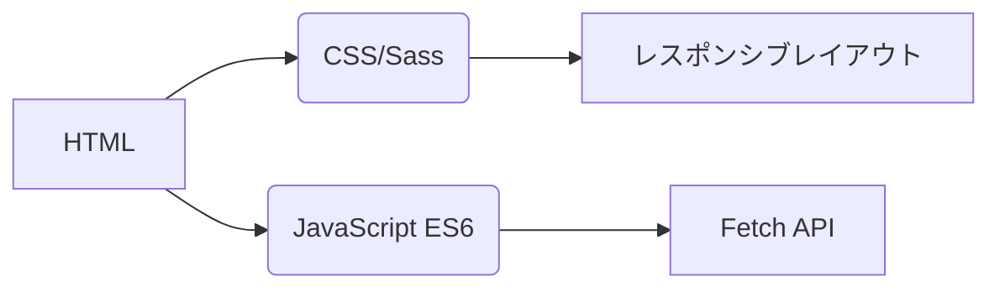
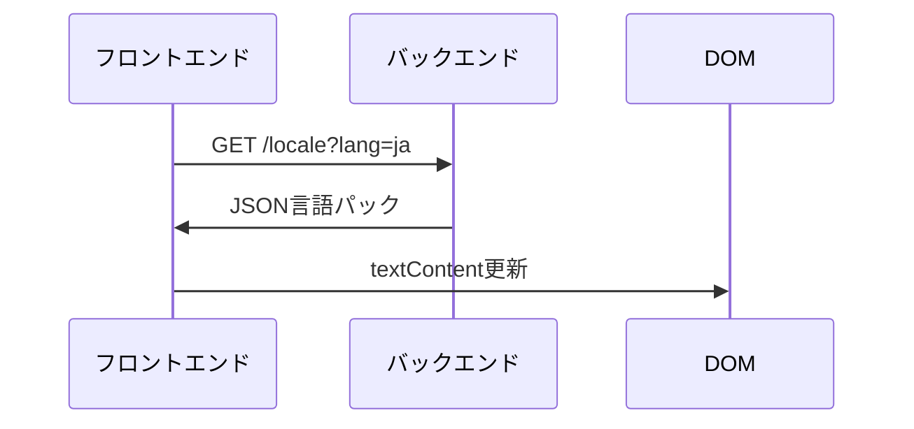
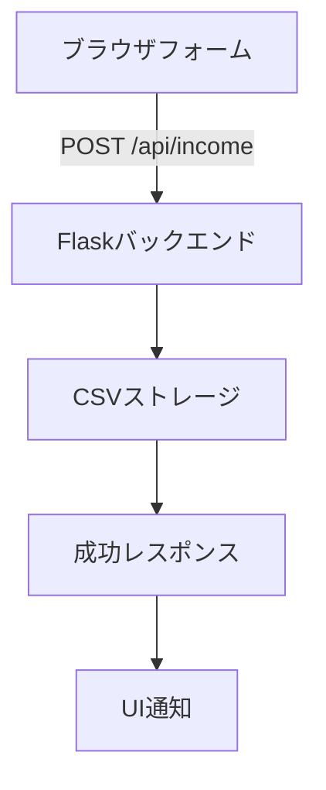

# 収入トラッカー
## 国際化対応  
本アプリケーションは**20言語**をネイティブレベルのローカライズでサポートします。翻訳ファイルは`/locales`ディレクトリにあります：

- [アラビア語 (العربية)](ar.md)  
- [中国語 (古典)](zh.md)  
- [オランダ語](nl.md)  
- [英語](README.md) (主要ドキュメント)  
- [フランス語](fr.md)  
- [ドイツ語](de.md)  
- [ヒンディー語](hi.md)  
- [インドネシア語](id.md)  
- [イタリア語](it.md)  
- **[日本語](ja.md)**  
- [韓国語](ko.md)  
- [ポーランド語](pl.md)  
- [ポルトガル語](pt.md)  
- [ロシア語](ru.md)  
- [スペイン語](es.md)  
- [スウェーデン語](sv.md)  
- [タイ語](th.md)  
- [トルコ語](tr.md)  
- [ウクライナ語](uk.md)  
- [ベトナム語](vi.md)  

---

# 収入管理システム

## プロジェクト概要
CSVデータストレージと適応型UIを備えた多言語財務追跡アプリケーション。システムの特徴：

- リアルタイム収入記録
- グローバル言語サポート
- 永続的データ管理
- テーマカスタマイズ
- モバイル対応デザイン

## 主な機能  
| 機能 | 説明 | 技術 |
|---------|-------------|------------|
| **収入記録** | 財務エントリの追加、表示、管理 | HTMLフォーム + CSV |
| **多言語UI** | 20言語のネイティブローカライズ | JSON i18n |
| **データ永続性** | 財務記録の安全な保存 | CSVファイル |
| **ダーク/ライトモード** | 適応型テーマ切替 | CSS変数 |
| **レスポンシブデザイン** | 全デバイスサイズ最適化 | CSSメディアクエリ |
| **ユーザー設定** | 言語とテーマ設定の記憶 | LocalStorage |

---

## 技術スタック  
**フロントエンド**  


**バックエンド**  
```mermaid
graph LR
F[Python Flask] --> G[CSVデータ処理]
F --> H[RESTful API]
H --> I[/api/income]
```

**データ管理**  
- CSVベースストレージ（データベース不要）
- 自動ファイル生成
- UTF-8エンコーディング対応

---

## インストール & セットアップ  
```bash
# 1. 依存関係のインストール
pip install flask flask-cors

# 2. アプリケーション起動
python server.py

# 3. システムアクセス
http://localhost:5000
```

**設定オプション**  
- ポート変更: `export FLASK_PORT=8080`
- デフォルト言語設定: `DEFAULT_LANG=es`

---

## 技術文書

### 国際化実装  
**ファイル構造**  
```
/locales
  ├── en.json    # 英語
  ├── ja.json    # 日本語
  └── ...        # 他18言語
```

**実装ワークフロー**  


### データフローアーキテクチャ  


### コアシステムコンポーネント  
#### 1. データ表示  
- RESTエンドポイント: `GET /api/income`
- 動的テーブル生成
- モバイル最適化カードレイアウト（画面 < 768px）

#### 2. テーマ管理  
```javascript
// テーマ切替ロジック
function テーマ切替() {
  const ダークモード = document.body.classList.toggle('ダークモード');
  localStorage.setItem('テーマ', ダークモード ? 'ダーク' : 'ライト');
}

// 設定から初期化
const 保存済みテーマ = localStorage.getItem('テーマ') || 
                   (matchMedia('(prefers-color-scheme: dark)').matches ? 'ダーク' : 'ライト');
document.body.classList.toggle('ダークモード', 保存済みテーマ === 'ダーク');
```

#### 3. レスポンシブデザイン  
**ブレークポイント戦略**  
```css
/* モバイルファーストデフォルト */
.テーブル行 { display: block; }

/* タブレット以上対応 */
@media (min-width: 768px) {
  .テーブル行 { display: table-row; }
}
```

---

## プロジェクト構造  
```
├── index.html               # アプリケーションエントリーポイント
├── styles.css               # グローバルスタイル（テーマ変数含む）
├── app.js                   # コアアプリケーションロジック
├── locales/                 # 言語リソースファイル
│   ├── en.json              # 英語翻訳
│   ├── ja.json              # 日本語翻訳
│   └── ...                  # 他18言語
├── data/                    # 永続的ストレージ
│   └── income.csv           # 財務記録（自動生成）
├── server.py                # Flask APIサーバー
└── docs/                    # ローカライズ済みドキュメント
    ├── README.md            # 英語ドキュメント
    ├── ja.md                # 日本語ドキュメント
    └── ...                  # 他18言語ドキュメント
```

---

## 開発ガイド  
### 新言語追加方法  
1. `/locales`に`[言語コード].json`作成  
2. `/docs`に対応`[言語コード].md`追加  
3. `app.js`言語セレクターに登録:  
```javascript
const 言語リスト = {
  'en': '英語',
  'ja': '日本語',
  // ... 他言語
};
```

### 機能拡張  
**推奨改善点**:  
1. 支出追跡モジュール  
2. データ可視化ダッシュボード  
3. マルチユーザーサポート  
4. クラウドストレージ統合  

---
> **システム要件**: Python 3.8+, モダンブラウザ (Chrome 88+, Firefox 84+, Safari 14+)  
> **ライセンス**: MIT オープンソース  
> **貢献方法**: CONTRIBUTING.md 参照  