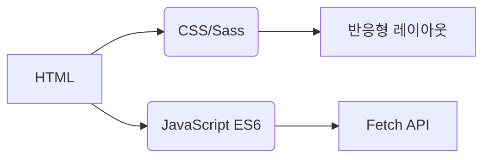
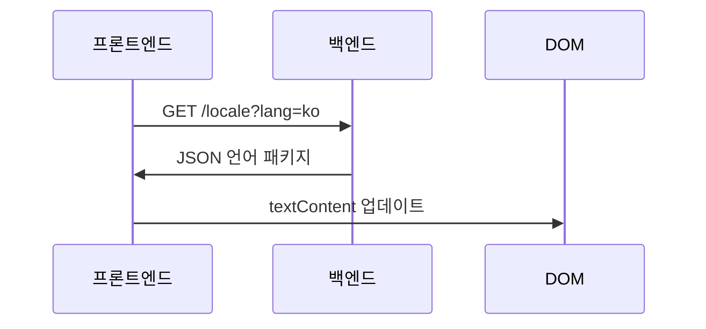
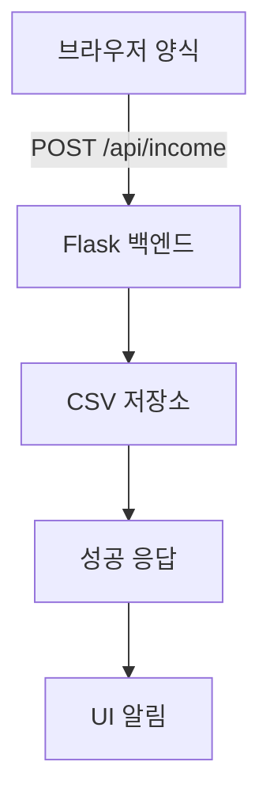

# 수입 추적기
## 국제화  
애플리케이션은 **20개 언어**를 네이티브 수준의 현지화로 지원합니다. 번역 파일은 `/locales` 디렉터리에서 확인할 수 있습니다:

- [아랍어 (العربية)](ar.md)  
- [중국어 (문어)](zh.md)  
- [네덜란드어](nl.md)  
- [영어](README.md) (기본 문서)  
- [프랑스어](fr.md)  
- [독일어](de.md)  
- [힌디어](hi.md)  
- [인도네시아어](id.md)  
- [이탈리아어](it.md)  
- [일본어](ja.md)  
- **[한국어](ko.md)**  
- [폴란드어](pl.md)  
- [포르투갈어](pt.md)  
- [러시아어](ru.md)  
- [스페인어](es.md)  
- [스웨덴어](sv.md)  
- [태국어](th.md)  
- [터키어](tr.md)  
- [우크라이나어](uk.md)  
- [베트남어](vi.md)  

---

# 소득 추적 시스템

## 프로젝트 개요
CSV 데이터 저장 및 적응형 UI를 갖춘 다국어 재무 추적 애플리케이션입니다. 시스템 기능:

- 실시간 소득 기록
- 글로벌 언어 지원
- 영구 데이터 관리
- 테마 커스터마이징
- 모바일 반응형 디자인

## 주요 기능  
| 기능 | 설명 | 기술 |
|---------|-------------|------------|
| **소득 기록** | 재무 항목 추가, 조회 및 관리 | HTML 양식 + CSV |
| **다국어 UI** | 20개 언어 네이티브 현지화 | JSON i18n |
| **데이터 영속성** | 재무 기록 보안 저장 | CSV 파일 |
| **다크/라이트 모드** | 적응형 테마 전환 | CSS 변수 |
| **반응형 디자인** | 모든 기기 크기 최적화 | CSS 미디어 쿼리 |
| **사용자 환경 설정** | 언어 및 테마 설정 기억 | 로컬 스토리지 |

---

## 기술 스택  
**프론트엔드**  


**백엔드**  
```mermaid
graph LR
F[Python Flask] --> G[CSV 데이터 처리]
F --> H[RESTful API]
H --> I[/api/income]
```

**데이터 관리**  
- CSV 기반 저장소 (데이터베이스 불필요)
- 자동 파일 생성
- UTF-8 인코딩 지원

---

## 설치 및 설정  
```bash
# 1. 의존성 설치
pip install flask flask-cors

# 2. 애플리케이션 시작
python server.py

# 3. 시스템 접속
http://localhost:5000
```

**구성 옵션**  
- 포트 변경: `export FLASK_PORT=8080`
- 기본 언어 설정: `DEFAULT_LANG=es`

---

## 기술 문서

### 국제화 구현  
**파일 구조**  
```
/locales
  ├── en.json    # 영어
  ├── ko.json    # 한국어
  └── ...        # 기타 18개 언어
```

**구현 워크플로**  


### 데이터 흐름 아키텍처  


### 핵심 시스템 구성 요소  
#### 1. 데이터 표시  
- REST 엔드포인트: `GET /api/income`
- 동적 테이블 생성
- 모바일 최적화 카드 레이아웃 (화면 < 768px)

#### 2. 테마 관리  
```javascript
// 테마 전환 로직
function 테마전환() {
  const 다크모드 = document.body.classList.toggle('다크모드');
  localStorage.setItem('테마', 다크모드 ? '다크' : '라이트');
}

// 환경 설정 초기화
const 저장된테마 = localStorage.getItem('테마') || 
                   (matchMedia('(prefers-color-scheme: dark)').matches ? '다크' : '라이트');
document.body.classList.toggle('다크모드', 저장된테마 === '다크');
```

#### 3. 반응형 디자인  
**중단점 전략**  
```css
/* 모바일 우선 기본값 */
.테이블행 { display: block; }

/* 태블릿+ 최적화 */
@media (min-width: 768px) {
  .테이블행 { display: table-row; }
}
```

---

## 프로젝트 구조  
```
├── index.html               # 애플리케이션 진입점
├── styles.css               # 글로벌 스타일 (테마 변수 포함)
├── app.js                   # 핵심 애플리케이션 로직
├── locales/                 # 언어 리소스 파일
│   ├── en.json              # 영어 번역
│   ├── ko.json              # 한국어 번역
│   └── ...                  # 기타 18개 언어
├── data/                    # 영구 저장소
│   └── income.csv           # 재무 기록 (자동 생성)
├── server.py                # Flask API 서버
└── docs/                    # 현지화 문서
    ├── README.md            # 영어 문서
    ├── ko.md                # 한국어 문서
    └── ...                  # 기타 18개 언어 문서
```

---

## 개발 가이드  
### 새 언어 추가 방법  
1. `/locales`에 `[언어코드].json` 생성  
2. `/docs`에 해당 `[언어코드].md` 추가  
3. `app.js` 언어 선택기에 등록:  
```javascript
const 언어목록 = {
  'en': '영어',
  'ko': '한국어',
  // ... 기타 언어
};
```

### 기능 확장  
**권장 개선 사항**:  
1. 지출 추적 모듈  
2. 데이터 시각화 대시보드  
3. 다중 사용자 지원  
4. 클라우드 저장소 통합  

---
> **시스템 요구사항**: Python 3.8+, 모던 브라우저 (Chrome 88+, Firefox 84+, Safari 14+)  
> **라이선스**: MIT 오픈소스  
> **기여**: 지침은 CONTRIBUTING.md 참조  
