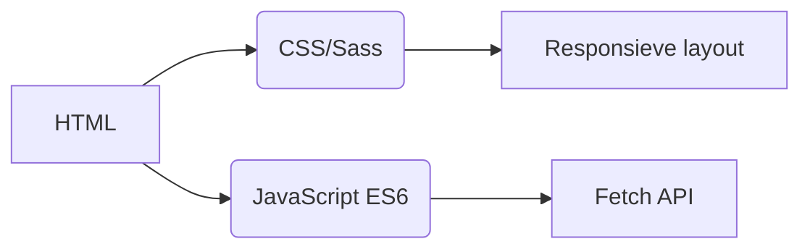
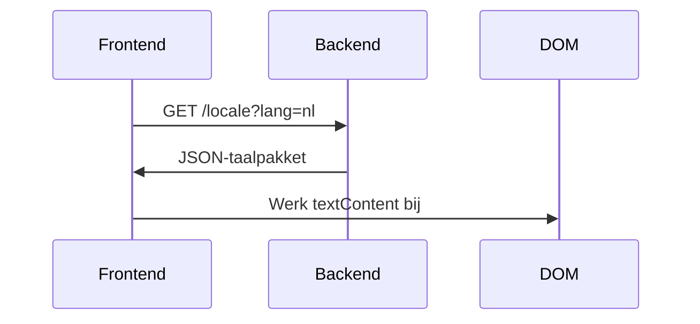
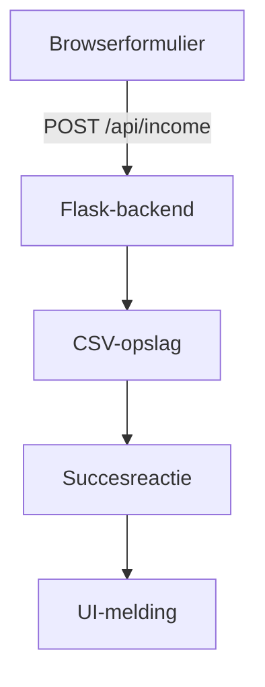

# Inkomstenregistratie
## Internationalisering
De applicatie ondersteunt **20 talen** met moedertaalniveau lokalisatie. Vertaalbestanden zijn beschikbaar in de map `/locales`:

- [Arabisch (العربية)](ar.md)
- [Chinees (Klassiek Chinees)](zh.md)
- **[Nederlands](nl.md)**
- [Engels](README.md) (Primaire documentatie)
- [Frans (Français)](fr.md)
- [Duits (Deutsch)](de.md)
- [Hindi (हिन्दी)](hi.md)
- [Indonesisch (Bahasa Indonesia)](id.md)
- [Italiaans (Italiano)](it.md)
- [Japans (日本語)](ja.md)
- [Koreaans (한국어)](ko.md)
- [Pools (Polski)](pl.md)
- [Portugees (Português)](pt.md)
- [Russisch (Русский)](ru.md)
- [Spaans (Español)](es.md)
- [Zweeds (Svenska)](sv.md)
- [Thais (ไทย)](th.md)
- [Turks (Türkçe)](tr.md)
- [Oekraïens (Українська)](uk.md)
- [Vietnamees (Tiếng Việt)](vi.md)

---

# Inkomstenregistratiesysteem

## Projectoverzicht
Een meertalige financiële registratie-applicatie met CSV-gegevensopslag en adaptieve interface. Het systeem biedt:

- Real-time inkomstenregistratie
- Wereldwijde taalondersteuning
- Persistente gegevensbeheer
- Thema-aanpassing
- Mobielvriendelijk ontwerp

## Kernfuncties
| Functie | Beschrijving | Technologie |
|---------|-------------|------------|
| **Inkomstenregistratie** | Financiële gegevens toevoegen, bekijken en beheren | HTML-formulier + CSV |
| **Meertalige interface** | 20 talen met native lokalisatie | JSON i18n |
| **Gegevenspersistentie** | Veilige opslag van financiële gegevens | CSV-bestanden |
| **Donkere/Lichte modus** | Adaptieve themaschakeling | CSS-variabelen |
| **Responsief ontwerp** | Geoptimaliseerd voor alle apparaatgroottes | CSS-mediaquery's |
| **Gebruikersvoorkeuren** | Onthouden taal- en themainstellingen | LocalStorage |

---

## Technologiestack
**Frontend**  


**Backend**  
```mermaid
graph LR
F[Python Flask] --> G[CSV-gegevensverwerking]
F --> H[RESTful API]
H --> I[/api/income]
```

**Gegevensbeheer**  
- CSV-gebaseerde opslag (geen database nodig)
- Automatische bestandsaanmaak
- UTF-8-coderingondersteuning

---

## Installatie & Configuratie
```bash
# 1. Installeer afhankelijkheden
pip install flask flask-cors

# 2. Start de applicatie
python server.py

# 3. Toegang tot het systeem
http://localhost:5000
```

**Configuratieopties**  
- Poort wijzigen: `export FLASK_PORT=8080`
- Standaardtaal instellen: `DEFAULT_LANG=es`

---

## Technische documentatie

### Implementatie van internationalisering
**Bestandsstructuur**  
```
/locales
  ├── en.json    # Engels
  ├── nl.json    # Nederlands
  └── ...        # 18 andere talen
```

**Implementatieworkflow**  


### Gegevensstroomarchitectuur


### Kernsysteemcomponenten
#### 1. Gegevenspresentatie
- REST-eindpunt: `GET /api/income`
- Dynamische tabelgeneratie
- Mobielgeoptimaliseerde kaartlay-out (schermen < 768px)

#### 2. Themabeheer
```javascript
// Thema-schakellogica
function wisselThema() {
  const isDonker = document.body.classList.toggle('donkere-modus');
  localStorage.setItem('thema', isDonker ? 'donker' : 'licht');
}

// Initialiseer vanuit voorkeuren
const opgeslagenThema = localStorage.getItem('thema') || 
                   (matchMedia('(prefers-color-scheme: dark)').matches ? 'donker' : 'licht');
document.body.classList.toggle('donkere-modus', opgeslagenThema === 'donker');
```

#### 3. Responsief ontwerp
**Breekpuntstrategie**  
```css
/* Standaard mobiel-first */
.table-rij { display: block; }

/* Aanpassing voor tablet+ */
@media (min-width: 768px) {
  .table-rij { display: table-row; }
}
```

---

## Projectstructuur
```
├── index.html               # Applicatie-ingangspunt
├── styles.css               # Globale stijlen met themavariabelen
├── app.js                   # Kernapplicatielogica
├── locales/                 # Taalbronbestanden
│   ├── ar.json              # Arabische vertalingen
│   ├── nl.json              # Nederlandse vertalingen
│   └── ...                  # 18 aanvullende talen
├── data/                    # Persistente opslag
│   └── income.csv           # Financiële registraties (automatisch aangemaakt)
├── server.py                # Flask API-server
└── docs/                    # Gelokaliseerde documentatie
    ├── README.md            # Engelstalige documentatie
    ├── nl.md                # Nederlandstalige documentatie
    └── ...                  # Documentatie in 18 talen
```

---

## Ontwikkelingsgids
### Nieuwe talen toevoegen
1. Maak `[taalcode].json` in `/locales`
2. Voeg corresponderend `[taalcode].md` toe in `/docs`
3. Registreer in `app.js` taalselector:
```javascript
const TALEN = {
  'en': 'Engels',
  'nl': 'Nederlands',
  // ... andere talen
};
```

### Functionaliteit uitbreiden
**Voorgestelde verbeteringen**:
1. Uitgavenregistratiemodule
2. Gegevensvisualisatiedashboard
3. Ondersteuning voor meerdere gebruikers
4. Cloudopslagintegratie

---
> **Systeemvereisten**: Python 3.8+, Moderne browser (Chrome 88+, Firefox 84+, Safari 14+)  
> **Licentie**: MIT Open Source  
> **Bijdragen**: Zie CONTRIBUTING.md voor richtlijnen
