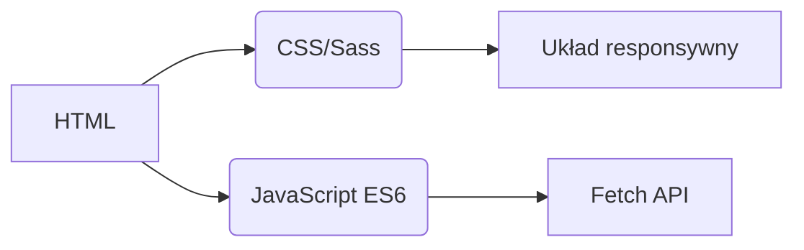
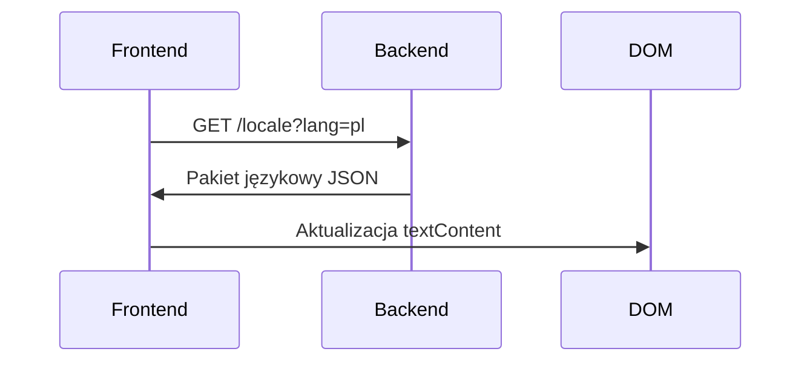
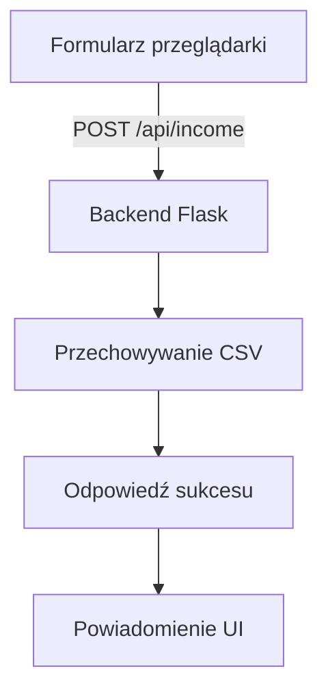

# Śledzenie Przychodów
## Internacjonalizacja  
Aplikacja obsługuje **20 języków** z natywną lokalizacją. Pliki tłumaczeń dostępne są w katalogu `/locales`:

- [Arabski (العربية)](ar.md)  
- [Chiński (Klasyczny)](zh.md)  
- [Holenderski](nl.md)  
- [Angielski](README.md) (Dokumentacja podstawowa)  
- [Francuski](fr.md)  
- [Niemiecki](de.md)  
- [Hindi](hi.md)  
- [Indonezyjski](id.md)  
- [Włoski](it.md)  
- [Japoński](ja.md)  
- [Koreański](ko.md)  
- **[Polski](pl.md)**  
- [Portugalski](pt.md)  
- [Rosyjski](ru.md)  
- [Hiszpański](es.md)  
- [Szwedzki](sv.md)  
- [Tajski](th.md)  
- [Turecki](tr.md)  
- [Ukraiński](uk.md)  
- [Wietnamski](vi.md)  

---

# System Śledzenia Przychodów

## Przegląd Projektu  
Wielojęzyczna aplikacja finansowa z przechowywaniem danych CSV i adaptacyjnym interfejsem. System oferuje:

- Rejestrację przychodów w czasie rzeczywistym
- Globalne wsparcie językowe
- Trwałe zarządzanie danymi
- Dostosowywanie motywu
- Projekt responsywny dla urządzeń mobilnych

## Kluczowe Funkcje  
| Funkcja | Opis | Technologia |
|---------|-------------|------------|
| **Rejestracja przychodów** | Dodawanie, przeglądanie i zarządzanie wpisami finansowymi | Formularz HTML + CSV |
| **Wielojęzyczny interfejs** | 20 języków z natywną lokalizacją | JSON i18n |
| **Trwałość danych** | Bezpieczne przechowywanie zapisów finansowych | Pliki CSV |
| **Tryb ciemny/jasny** | Adaptacyjne przełączanie motywu | Zmienne CSS |
| **Projekt responsywny** | Zoptymalizowany dla wszystkich rozmiarów urządzeń | Zapytania medialne CSS |
| **Preferencje użytkownika** | Zapamiętywanie ustawień języka i motywu | LocalStorage |

---

## Stos Technologiczny  
**Frontend**  


**Backend**  
```mermaid
graph LR
F[Python Flask] --> G[Obsługa danych CSV]
F --> H[API RESTful]
H --> I[/api/income]
```

**Zarządzanie danymi**  
- Przechowywanie oparte na CSV (baza danych nie jest wymagana)
- Automatyczne tworzenie plików
- Obsługa kodowania UTF-8

---

## Instalacja i Konfiguracja  
```bash
# 1. Instalacja zależności
pip install flask flask-cors

# 2. Uruchomienie aplikacji
python server.py

# 3. Dostęp do systemu
http://localhost:5000
```

**Opcje konfiguracyjne**  
- Zmiana portu: `export FLASK_PORT=8080`
- Ustawienie domyślnego języka: `DEFAULT_LANG=es`

---

## Dokumentacja Techniczna

### Implementacja internacjonalizacji  
**Struktura plików**  
```
/locales
  ├── en.json    # Angielski
  ├── pl.json    # Polski
  └── ...        # 18 innych języków
```

**Proces implementacji**  


### Architektura przepływu danych  


### Główne komponenty systemu  
#### 1. Prezentacja danych  
- Punkt końcowy REST: `GET /api/income`
- Generowanie dynamicznych tabel
- Układ kart zoptymalizowany dla urządzeń mobilnych (ekrany < 768px)

#### 2. Zarządzanie motywem  
```javascript
// Logika przełączania motywu
function toggleTheme() {
  const isDark = document.body.classList.toggle('dark-mode');
  localStorage.setItem('theme', isDark ? 'dark' : 'light');
}

// Inicjalizacja z preferencji
const savedTheme = localStorage.getItem('theme') || 
                   (matchMedia('(prefers-color-scheme: dark)').matches ? 'dark' : 'light');
document.body.classList.toggle('dark-mode', savedTheme === 'dark');
```

#### 3. Projekt responsywny  
**Strategia punktów przerwania**  
```css
/* Domyślne ustawienie mobile-first */
.table-row { display: block; }

/* Adaptacja dla tabletów+ */
@media (min-width: 768px) {
  .table-row { display: table-row; }
}
```

---

## Struktura Projektu  
```
├── index.html               # Punkt wejścia aplikacji
├── styles.css               # Globalne style ze zmiennymi motywu
├── app.js                   # Główna logika aplikacji
├── locales/                 # Pliki zasobów językowych
│   ├── en.json              # Tłumaczenia angielskie
│   ├── pl.json              # Tłumaczenia polskie
│   └── ...                  # 18 dodatkowych języków
├── data/                    # Trwałe przechowywanie
│   └── income.csv           # Rekordy finansowe (tworzone automatycznie)
├── server.py                # Serwer API Flask
└── docs/                    # Zlokalizowana dokumentacja
    ├── README.md            # Dokumentacja angielska
    ├── pl.md                # Dokumentacja polska
    └── ...                  # Dokumentacja w 18 językach
```

---

## Poradnik dla Deweloperów  
### Dodawanie nowych języków  
1. Utwórz `[kod-języka].json` w `/locales`
2. Dodaj odpowiadający `[kod-języka].md` w `/docs`
3. Zarejestruj w selektorze języków `app.js`:
```javascript
const JĘZYKI = {
  'en': 'Angielski',
  'pl': 'Polski',
  // ... inne języki
};
```

### Rozszerzanie funkcjonalności  
**Proponowane ulepszenia**:  
1. Moduł śledzenia wydatków  
2. Panel wizualizacji danych  
3. Obsługa wielu użytkowników  
4. Integracja z przechowywaniem w chmurze  

---
> **Wymagania systemowe**: Python 3.8+, Nowoczesna przeglądarka (Chrome 88+, Firefox 84+, Safari 14+)  
> **Licencja**: MIT Open Source  
> **Współtworzenie**: Zobacz CONTRIBUTING.md wytyczne  