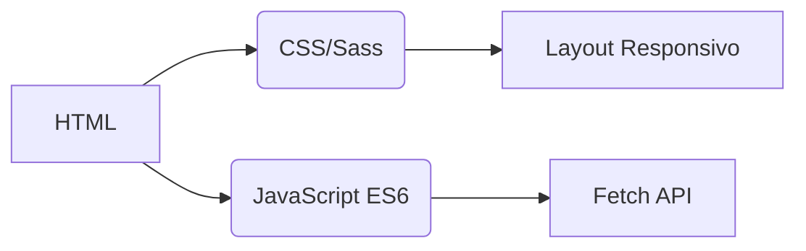
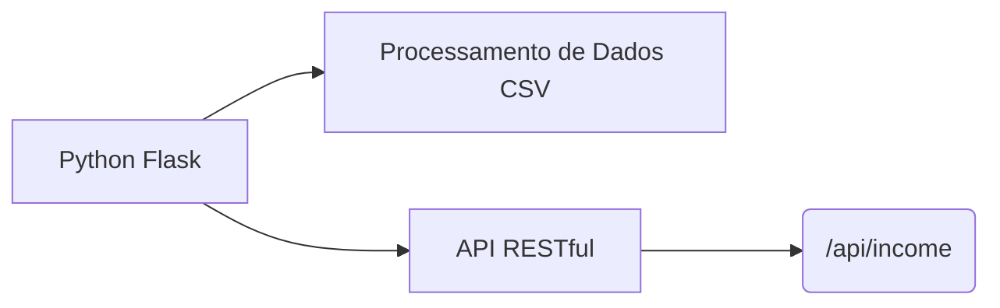
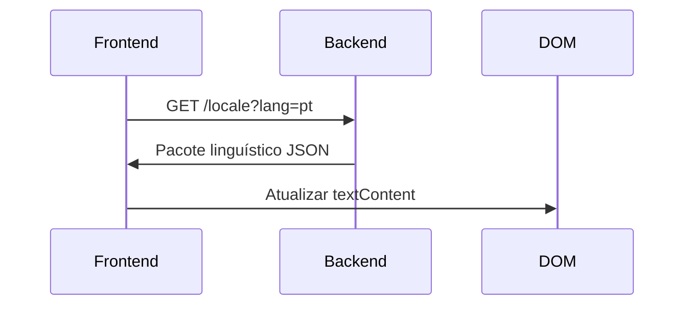
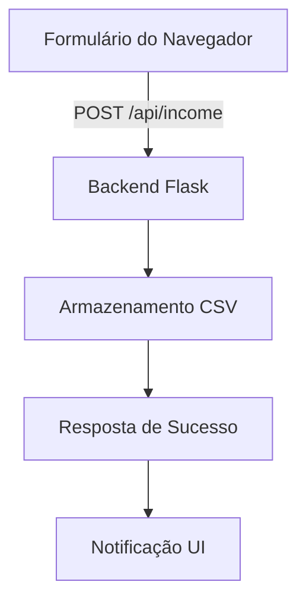

# Rastreador de Rendimentos
## Internacionalização  
A aplicação suporta **20 idiomas** com localização de nível nativo. Ficheiros de tradução disponíveis no diretório `/locales`:

- [Árabe (العربية)](ar.md)  
- [Chinês Clássico (文言)](zh.md)  
- [Holandês](nl.md)  
- [Inglês](README.md) (Documentação primária)  
- [Francês](fr.md)  
- [Alemão](de.md)  
- [Hindi](hi.md)  
- [Indonésio](id.md)  
- [Italiano](it.md)  
- [Japonês](ja.md)  
- [Coreano](ko.md)  
- [Polaco](pl.md)  
- **[Português](pt.md)**  
- [Russo](ru.md)  
- [Espanhol](es.md)  
- [Sueco](sv.md)  
- [Tailandês](th.md)  
- [Turco](tr.md)  
- [Ucraniano](uk.md)  
- [Vietnamita](vi.md)  

---

# Sistema de Monitorização de Rendimentos

## Visão Geral do Projeto  
Aplicação financeira multilíngue com armazenamento de dados CSV e interface adaptativa. O sistema oferece:

- Registo de rendimentos em tempo real
- Suporte linguístico global
- Gestão persistente de dados
- Personalização de temas
- Design responsivo para dispositivos móveis

## Funcionalidades Principais  
| Funcionalidade | Descrição | Tecnologia |
|---------|-------------|------------|
| **Registo de Rendimentos** | Adicionar, visualizar e gerir entradas financeiras | Formulário HTML + CSV |
| **Interface Multilíngue** | 20 idiomas com localização nativa | JSON i18n |
| **Persistência de Dados** | Armazenamento seguro de registos financeiros | Ficheiros CSV |
| **Modo Escuro/Claro** | Alternância adaptativa de temas | Variáveis CSS |
| **Design Responsivo** | Otimizado para todos os tamanhos de dispositivos | Media Queries CSS |
| **Preferências do Utilizador** | Definições de idioma e tema memorizadas | LocalStorage |

---

## Stack Tecnológico  
**Frontend**  


**Backend**  


**Gestão de Dados**  
- Armazenamento baseado em CSV (sem base de dados necessária)
- Criação automática de ficheiros
- Suporte a codificação UTF-8

---

## Instalação & Configuração  
```bash
# 1. Instalar dependências
pip install flask flask-cors

# 2. Iniciar aplicação
python server.py

# 3. Aceder ao sistema
http://localhost:5000
```

**Opções de Configuração**  
- Alterar porta: `export FLASK_PORT=8080`
- Definir idioma padrão: `DEFAULT_LANG=es`

---

## Documentação Técnica

### Implementação da Internacionalização  
**Estrutura de Ficheiros**  
```
/locales
  ├── en.json    # Inglês
  ├── pt.json    # Português
  └── ...        # 18 outros idiomas
```

**Fluxo de Implementação**  


### Arquitetura de Fluxo de Dados  


### Componentes Principais do Sistema  
#### 1. Apresentação de Dados  
- Endpoint REST: `GET /api/income`
- Geração dinâmica de tabelas
- Layout de cartões otimizado para móvel (ecrãs < 768px)

#### 2. Gestão de Temas  
```javascript
// Lógica de alternância de tema
function alternarTema() {
  const isDark = document.body.classList.toggle('modo-escuro');
  localStorage.setItem('tema', isDark ? 'escuro' : 'claro');
}

// Inicializar a partir de preferências
const temaGuardado = localStorage.getItem('tema') || 
                   (matchMedia('(prefers-color-scheme: dark)').matches ? 'escuro' : 'claro');
document.body.classList.toggle('modo-escuro', temaGuardado === 'escuro');
```

#### 3. Design Responsivo  
**Estratégia de Breakpoints**  
```css
/* Padrão mobile-first */
.linha-tabela { display: block; }

/* Adaptação para tablet+ */
@media (min-width: 768px) {
  .linha-tabela { display: table-row; }
}
```

---

## Estrutura do Projeto  
```
├── index.html               # Ponto de entrada da aplicação
├── styles.css               # Estilos globais com variáveis de tema
├── app.js                   # Lógica principal da aplicação
├── locales/                 # Ficheiros de recursos linguísticos
│   ├── en.json              # Traduções inglesas
│   ├── pt.json              # Traduções portuguesas
│   └── ...                  # 18 idiomas adicionais
├── data/                    # Armazenamento persistente
│   └── income.csv           # Registos financeiros (criado automaticamente)
├── server.py                # Servidor API Flask
└── docs/                    # Documentação localizada
    ├── README.md            # Documentação inglesa
    ├── pt.md                # Documentação portuguesa
    └── ...                  # Documentos para 18 idiomas
```

---

## Guia de Desenvolvimento  
### Adicionar Novos Idiomas  
1. Criar `[código-idioma].json` em `/locales`
2. Adicionar `[código-idioma].md` correspondente em `/docs`
3. Registar no seletor de idiomas `app.js`:
```javascript
const IDIOMAS = {
  'en': 'Inglês',
  'pt': 'Português',
  // ... outros idiomas
};
```

### Expandir Funcionalidades  
**Melhorias Sugeridas**:  
1. Módulo de monitorização de despesas  
2. Dashboard de visualização de dados  
3. Suporte multiutilizador  
4. Integração com armazenamento na nuvem  

---
> **Requisitos do Sistema**: Python 3.8+, Navegador Moderno (Chrome 88+, Firefox 84+, Safari 14+)  
> **Licença**: AGPL-3.0 Open Source  
> **Contribuições**: Ver CONTRIBUTING.md para orientações  