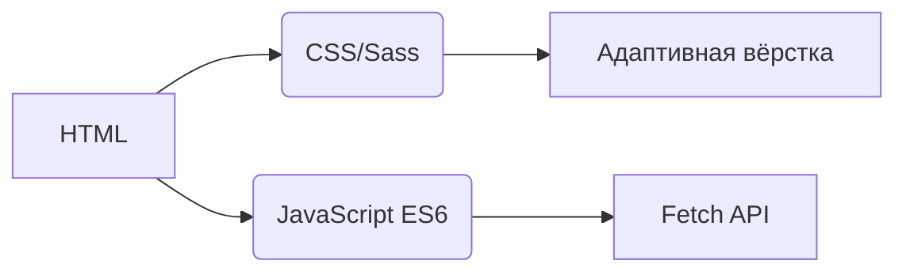
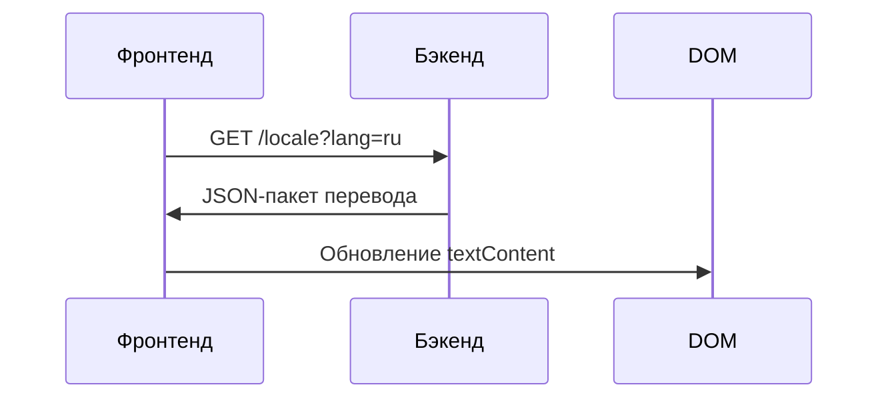
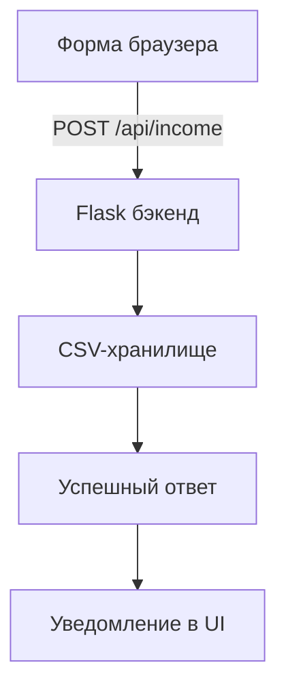

# Трекер Доходов
## Интернационализация  
Приложение поддерживает **20 языков** с локализацией на уровне носителя. Файлы переводов доступны в каталоге `/locales`:

- [Арабский (العربية)](ar.md)  
- [Китайский (Классический)](zh.md)  
- [Нидерландский](nl.md)  
- [Английский](README.md) (Основная документация)  
- [Французский](fr.md)  
- [Немецкий](de.md)  
- [Хинди](hi.md)  
- [Индонезийский](id.md)  
- [Итальянский](it.md)  
- [Японский](ja.md)  
- [Корейский](ko.md)  
- [Польский](pl.md)  
- [Португальский](pt.md)  
- **[Русский](ru.md)**  
- [Испанский](es.md)  
- [Шведский](sv.md)  
- [Тайский](th.md)  
- [Турецкий](tr.md)  
- [Украинский](uk.md)  
- [Вьетнамский](vi.md)  

---

# Система Учёта Доходов

## Обзор Проекта  
Многоязычное финансовое приложение с хранением данных в CSV и адаптивным интерфейсом. Система предоставляет:

- Запись доходов в реальном времени
- Глобальную языковую поддержку
- Постоянное хранение данных
- Настройку тем оформления
- Адаптивный дизайн для мобильных устройств

## Ключевые Возможности  
| Функция | Описание | Технология |
|---------|-------------|------------|
| **Учёт доходов** | Добавление, просмотр и управление финансовыми записями | HTML-форма + CSV |
| **Многоязычный интерфейс** | 20 языков с нативной локализацией | JSON i18n |
| **Сохранность данных** | Безопасное хранение финансовых записей | CSV-файлы |
| **Тёмный/Светлый режим** | Адаптивное переключение тем | CSS-переменные |
| **Адаптивный дизайн** | Оптимизировано для всех размеров устройств | CSS Media Queries |
| **Пользовательские настройки** | Сохранение языка и темы | LocalStorage |

---

## Технологический Стек  
**Фронтенд**  


**Бэкенд**  
```mermaid
graph LR
F[Python Flask] --> G[Обработка CSV-данных]
F --> H[RESTful API]
H --> I[/api/income]
```

**Управление данными**  
- CSV-хранилище (база данных не требуется)
- Автоматическое создание файлов
- Поддержка кодировки UTF-8

---

## Установка и Настройка  
```bash
# 1. Установите зависимости
pip install flask flask-cors

# 2. Запустите приложение
python server.py

# 3. Откройте систему
http://localhost:5000
```

**Параметры конфигурации**  
- Изменить порт: `export FLASK_PORT=8080`
- Установить язык по умолчанию: `DEFAULT_LANG=es`

---

## Техническая Документация

### Реализация интернационализации  
**Структура файлов**  
```
/locales
  ├── en.json    # Английский
  ├── ru.json    # Русский
  └── ...        # 18 других языков
```

**Процесс реализации**  


### Архитектура потока данных  


### Основные компоненты системы  
#### 1. Отображение данных  
- REST-эндпоинт: `GET /api/income`
- Динамическое создание таблиц
- Карточный макет для мобильных (экраны < 768px)

#### 2. Управление темами  
```javascript
// Логика переключения темы
function переключитьТему() {
  const тёмная = document.body.classList.toggle('тёмная-тема');
  localStorage.setItem('тема', тёмная ? 'тёмная' : 'светлая');
}

// Инициализация из настроек
const сохранённаяТема = localStorage.getItem('тема') || 
                   (matchMedia('(prefers-color-scheme: dark)').matches ? 'тёмная' : 'светлая');
document.body.classList.toggle('тёмная-тема', сохранённаяТема === 'тёмная');
```

#### 3. Адаптивный дизайн  
**Стратегия брейкпоинтов**  
```css
/* Мобильный подход по умолчанию */
.строка-таблицы { display: block; }

/* Адаптация для планшетов+ */
@media (min-width: 768px) {
  .строка-таблицы { display: table-row; }
}
```

---

## Структура Проекта  
```
├── index.html               # Точка входа приложения
├── styles.css               # Глобальные стили с переменными темы
├── app.js                   # Основная логика приложения
├── locales/                 # Файлы языковых ресурсов
│   ├── en.json              # Английские переводы
│   ├── ru.json              # Русские переводы
│   └── ...                  # 18 дополнительных языков
├── data/                    # Постоянное хранилище
│   └── income.csv           # Финансовые записи (создаётся автоматически)
├── server.py                # Flask API-сервер
└── docs/                    # Локализованная документация
    ├── README.md            # Английская документация
    ├── ru.md                # Русская документация
    └── ...                  # Документы на 18 языках
```

---

## Руководство Разработчика  
### Добавление новых языков  
1. Создайте `[код-языка].json` в `/locales`
2. Добавьте соответствующий `[код-языка].md` в `/docs`
3. Зарегистрируйте в языковом селекторе `app.js`:
```javascript
const ЯЗЫКИ = {
  'en': 'Английский',
  'ru': 'Русский',
  // ... другие языки
};
```

### Расширение функциональности  
**Рекомендуемые улучшения**:  
1. Модуль учёта расходов  
2. Панель визуализации данных  
3. Поддержка многопользовательского режима  
4. Интеграция с облачным хранилищем  

---
> **Системные требования**: Python 3.8+, Современный браузер (Chrome 88+, Firefox 84+, Safari 14+)  
> **Лицензия**: MIT Open Source  
> **Участие**: См. CONTRIBUTING.md для руководства  