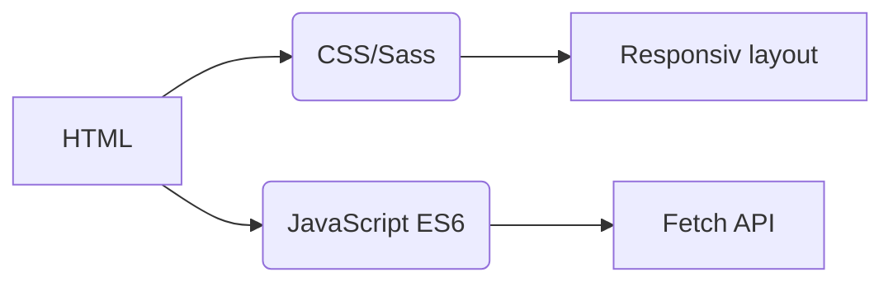
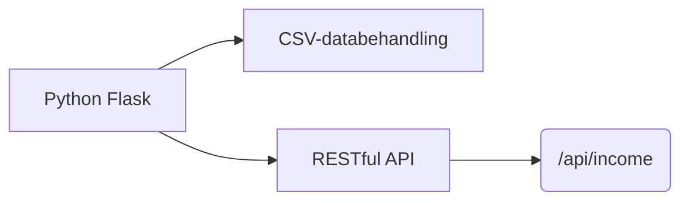
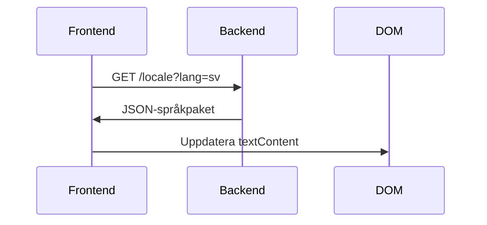
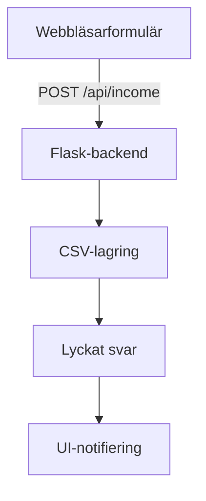

# Inkomstspårningssystem
## Internationalisering  
Applikationen stöder **20 språk** med lokalisation på modersmålsnivå. Översättningsfiler finns i katalogen `/locales`:

- [Arabiska (العربية)](ar.md)  
- [Klassisk kinesiska (文言)](zh.md)  
- [Nederländska](nl.md)  
- [Engelska](README.md) (Huvuddokumentation)  
- [Franska](fr.md)  
- [Tyska](de.md)  
- [Hindi](hi.md)  
- [Indonesiska](id.md)  
- [Italienska](it.md)  
- [Japanska](ja.md)  
- [Koreanska](ko.md)  
- [Polska](pl.md)  
- [Portugisiska](pt.md)  
- [Ryska](ru.md)  
- [Spanska](es.md)  
- **[Svenska](sv.md)**  
- [Thailändska](th.md)  
- [Turkiska](tr.md)  
- [Ukrainska](uk.md)  
- [Vietnamesiska](vi.md)  

---

# Inkomstspårningssystem

## Projektöversikt  
En flerspråkig ekonomispårningsapplikation med CSV-datalagring och anpassningsbar gränssnitt. Systemet erbjuder:

- Realtidsinkomstregistrering
- Globalt språkstöd
- Beständig datahantering
- Temaanpassning
- Mobilvänlig design

## Huvudfunktioner  
| Funktion | Beskrivning | Teknologi |
|---------|-------------|------------|
| **Inkomstregistrering** | Lägg till, visa och hantera finansiella poster | HTML-formulär + CSV |
| **Flerspråkigt gränssnitt** | 20 språk med inbyggd lokalisering | JSON i18n |
| **Datapersistens** | Säker lagring av finansiella poster | CSV-filer |
| **Mörkt/Ljust läge** | Anpassningsbar temaväxling | CSS-variabler |
| **Responsiv design** | Optimerad för alla enhetsstorlekar | CSS Media Queries |
| **Användarinställningar** | Språk- och temainställningar sparade | LocalStorage |

---

## Teknisk stack  
**Frontend**  


**Backend**  


**Datahantering**  
- CSV-baserad lagring (ingen databas krävs)
- Automatisk filskapning
- Stöd för UTF-8-kodning

---

## Installation & Konfiguration  
```bash
# 1. Installera beroenden
pip install flask flask-cors

# 2. Starta applikationen
python server.py

# 3. Få tillgång till systemet
http://localhost:5000
```

**Konfigurationsalternativ**  
- Ändra port: `export FLASK_PORT=8080`
- Ställ in standardspråk: `DEFAULT_LANG=es`

---

## Teknisk dokumentation

### Implementering av internationalisering  
**Filstruktur**  
```
/locales
  ├── en.json    # Engelska
  ├── sv.json    # Svenska
  └── ...        # 18 andra språk
```

**Implementeringsflöde**  


### Dataflödesarkitektur  


### Kärnsystemkomponenter  
#### 1. Datapresentation  
- REST-slutpunkt: `GET /api/income`
- Dynamisk tabellgenerering
- Mobiloptimerad kortlayout (skärmar < 768px)

#### 2. Temahantering  
```javascript
// Temaväxlingslogik
function växlaTema() {
  const ärMörkt = document.body.classList.toggle('mörkt-läge');
  localStorage.setItem('tema', ärMörkt ? 'mörkt' : 'ljust');
}

// Initiera från inställningar
const sparatTema = localStorage.getItem('tema') || 
                   (matchMedia('(prefers-color-scheme: dark)').matches ? 'mörkt' : 'ljust');
document.body.classList.toggle('mörkt-läge', sparatTema === 'mörkt');
```

#### 3. Responsiv design  
**Brytpunktsstrategi**  
```css
/* Mobil-first standard */
.tabellrad { display: block; }

/* Anpassning för surfplattor+ */
@media (min-width: 768px) {
  .tabellrad { display: table-row; }
}
```

---

## Projektstruktur  
```
├── index.html               # Applikationsingångspunkt
├── styles.css               # Globala stilar med temavariabler
├── app.js                   # Kärnapplikationslogik
├── locales/                 # Språkresursfiler
│   ├── en.json              # Engelska översättningar
│   ├── sv.json              # Svenska översättningar
│   └── ...                  # 18 ytterligare språk
├── data/                    # Beständig lagring
│   └── income.csv           # Finansiella poster (skapas automatiskt)
├── server.py                # Flask API-server
└── docs/                    # Lokaliserad dokumentation
    ├── README.md            # Engelsk dokumentation
    ├── sv.md                # Svensk dokumentation
    └── ...                  # Dokument för 18 språk
```

---

## Utvecklarhandledning  
### Lägga till nya språk  
1. Skapa `[språkkod].json` i `/locales`
2. Lägg till motsvarande `[språkkod].md` i `/docs`
3. Registrera i språkväljaren `app.js`:
```javascript
const SPRÅK = {
  'en': 'Engelska',
  'sv': 'Svenska',
  // ... andra språk
};
```

### Utöka funktionalitet  
**Föreslagna förbättringar**:  
1. Utgiftsspårningsmodul  
2. Datavisualiseringspanel  
3. Stöd för flera användare  
4. Molnlagringsintegration  

---
> **Systemkrav**: Python 3.8+, Modern webbläsare (Chrome 88+, Firefox 84+, Safari 14+)  
> **Licens**: AGPL-3.0 Öppen källkod  
> **Bidrag**: Se CONTRIBUTING.md för riktlinjer  