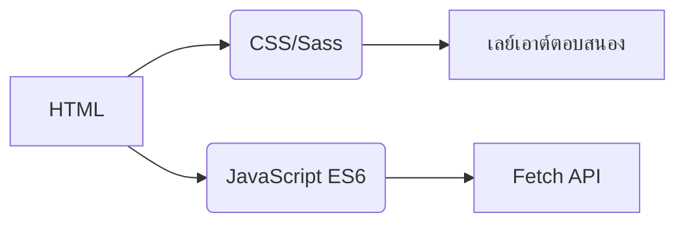
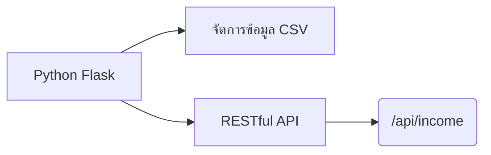
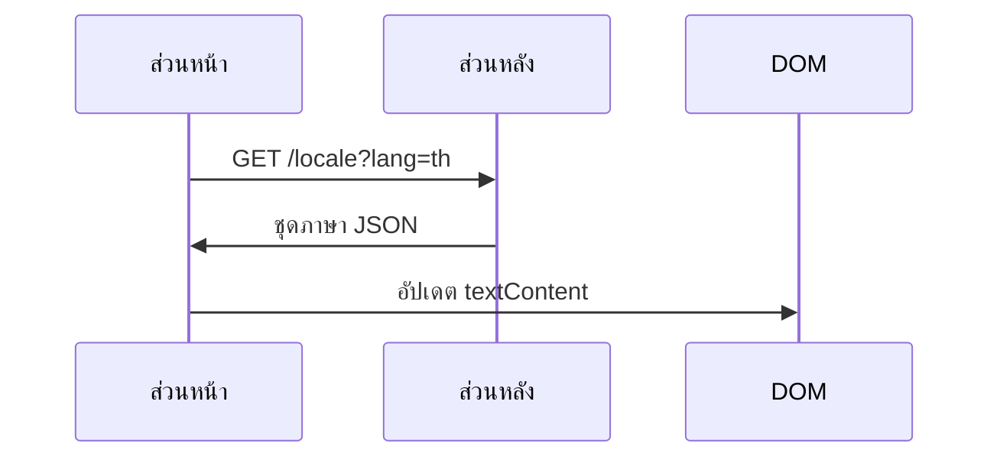
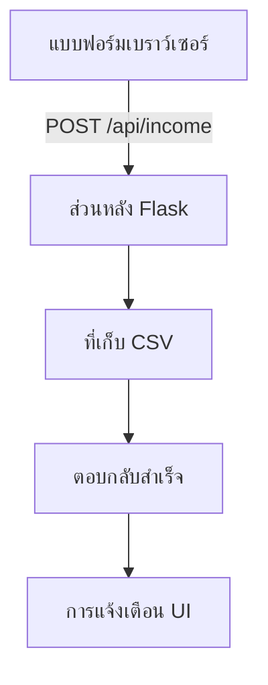

# ระบบติดตามรายได้
## การทำให้เป็นสากล  
แอปพลิเคชันรองรับ **20 ภาษา** ด้วยการแปลระดับเจ้าของภาษา ไฟล์แปลมีอยู่ในไดเรกทอรี `/locales`:

- [อาหรับ (العربية)](ar.md)  
- [จีนคลาสสิก (文言)](zh.md)  
- [ดัตช์](nl.md)  
- [อังกฤษ](README.md) (เอกสารหลัก)  
- [ฝรั่งเศส](fr.md)  
- [เยอรมัน](de.md)  
- [ฮินดี](hi.md)  
- [อินโดนีเซีย](id.md)  
- [อิตาลี](it.md)  
- [ญี่ปุ่น](ja.md)  
- [เกาหลี](ko.md)  
- [โปแลนด์](pl.md)  
- [โปรตุเกส](pt.md)  
- [รัสเซีย](ru.md)  
- [สเปน](es.md)  
- [สวีเดน](sv.md)  
- **[ไทย](th.md)**  
- [ตุรกี](tr.md)  
- [ยูเครน](uk.md)  
- [เวียดนาม](vi.md)  

---

# ระบบติดตามรายได้

## ภาพรวมโครงการ  
แอปพลิเคชันติดตามการเงินหลายภาษาพร้อมที่เก็บข้อมูล CSV และ UI ปรับเปลี่ยนได้ ระบบให้บริการ:

- บันทึกรายได้แบบเรียลไทม์
- รองรับหลายภาษาระดับโลก
- การจัดการข้อมูลถาวร
- ปรับแต่งธีม
- ออกแบบตอบสนองสำหรับมือถือ

## คุณสมบัติหลัก  
| คุณสมบัติ | คำอธิบาย | เทคโนโลยี |
|---------|-------------|------------|
| **บันทึกรายได้** | เพิ่ม ดู และจัดการรายการการเงิน | แบบฟอร์ม HTML + CSV |
| **UI หลายภาษา** | 20 ภาษาพร้อมการแปลระดับเจ้าของภาษา | JSON i18n |
| **ความคงทนของข้อมูล** | จัดเก็บบันทึกการเงินอย่างปลอดภัย | ไฟล์ CSV |
| **โหมดมืด/สว่าง** | สลับธีมอัตโนมัติ | ตัวแปร CSS |
| **การออกแบบตอบสนอง** | เพิ่มประสิทธิภาพสำหรับอุปกรณ์ทุกขนาด | CSS Media Queries |
| **การตั้งค่าผู้ใช้** | จำภาษากับธีมที่เลือก | LocalStorage |

---

## สแต็คเทคโนโลยี  
**ส่วนหน้า**  


**ส่วนหลัง**  


**การจัดการข้อมูล**  
- ที่เก็บข้อมูลแบบ CSV (ไม่ต้องใช้ฐานข้อมูล)
- สร้างไฟล์อัตโนมัติ
- รองรับการเข้ารหัส UTF-8

---

## การติดตั้ง & การตั้งค่า  
```bash
# 1. ติดตั้ง dependencies
pip install flask flask-cors

# 2. เริ่มแอปพลิเคชัน
python server.py

# 3. เข้าถึงระบบ
http://localhost:5000
```

**ตัวเลือกการกำหนดค่า**  
- เปลี่ยนพอร์ต: `export FLASK_PORT=8080`
- ตั้งค่าภาษาเริ่มต้น: `DEFAULT_LANG=es`

---

## เอกสารทางเทคนิค

### การทำให้เป็นสากล  
**โครงสร้างไฟล์**  
```
/locales
  ├── en.json    # อังกฤษ
  ├── th.json    # ไทย
  └── ...        # 18 ภาษาอื่น
```

**ขั้นตอนการทำงาน**  


### สถาปัตยกรรมการไหลของข้อมูล  


### ส่วนประกอบหลักของระบบ  
#### 1. การนำเสนอข้อมูล  
- REST endpoint: `GET /api/income`
- สร้างตารางไดนามิก
- เลย์เอาต์การ์ดสำหรับมือถือ (หน้าจอ < 768px)

#### 2. การจัดการธีม  
```javascript
// ตรรกะการสลับธีม
function สลับธีม() {
  const เป็นโหมดมืด = document.body.classList.toggle('โหมดมืด');
  localStorage.setItem('ธีม', เป็นโหมดมืด ? 'มืด' : 'สว่าง');
}

// เริ่มต้นจากการตั้งค่า
const ธีมที่บันทึก = localStorage.getItem('ธีม') || 
                   (matchMedia('(prefers-color-scheme: dark)').matches ? 'มืด' : 'สว่าง');
document.body.classList.toggle('โหมดมืด', ธีมที่บันทึก === 'มืด');
```

#### 3. การออกแบบตอบสนอง  
**กลยุทธ์ breakpoint**  
```css
/* ค่าเริ่มต้น mobile-first */
.แถวตาราง { display: block; }

/* ปรับสำหรับแท็บเล็ต+ */
@media (min-width: 768px) {
  .แถวตาราง { display: table-row; }
}
```

---

## โครงสร้างโครงการ  
```
├── index.html               # จุดเข้าแอปพลิเคชัน
├── styles.css               # สไตล์ส่วนกลางพร้อมตัวแปรธีม
├── app.js                   # ตรรกะหลักแอปพลิเคชัน
├── locales/                 # ไฟล์ทรัพยากรภาษา
│   ├── en.json              # คำแปลภาษาอังกฤษ
│   ├── th.json              # คำแปลภาษาไทย
│   └── ...                  # 18 ภาษาเพิ่มเติม
├── data/                    # ที่เก็บถาวร
│   └── income.csv           # บันทึกการเงิน (สร้างอัตโนมัติ)
├── server.py                # เซิร์ฟเวอร์ API Flask
└── docs/                    # เอกสารที่แปลแล้ว
    ├── README.md            # เอกสารภาษาอังกฤษ
    ├── th.md                # เอกสารภาษาไทย
    └── ...                  # เอกสาร 18 ภาษา
```

---

## คู่มือนักพัฒนา  
### เพิ่มภาษาใหม่  
1. สร้าง `[รหัสภาษา].json` ใน `/locales`
2. เพิ่ม `[รหัสภาษา].md` ที่ตรงกันใน `/docs`
3. ลงทะเบียนในตัวเลือกภาษา `app.js`:
```javascript
const ภาษา = {
  'en': 'อังกฤษ',
  'th': 'ไทย',
  // ... ภาษาอื่น
};
```

### ขยายฟังก์ชันการทำงาน  
**การปรับปรุงที่แนะนำ**:  
1. โมดูลติดตามค่าใช้จ่าย  
2. แดชบอร์ดแสดงข้อมูล  
3. รองรับหลายผู้ใช้  
4. การผสานรวมคลาวด์สตอเรจ  

---
> **ความต้องการระบบ**: Python 3.8+, เบราว์เซอร์สมัยใหม่ (Chrome 88+, Firefox 84+, Safari 14+)  
> **สัญญาอนุญาต**: AGPL-3.0 Open Source  
> **การมีส่วนร่วม**: ดู CONTRIBUTING.md สำหรับแนวทาง  