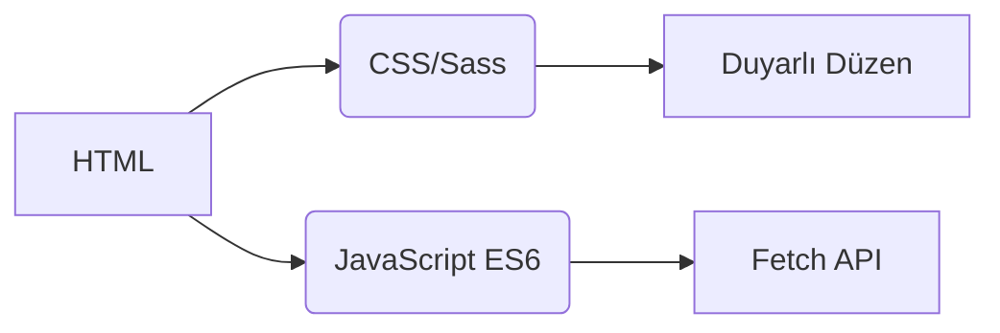
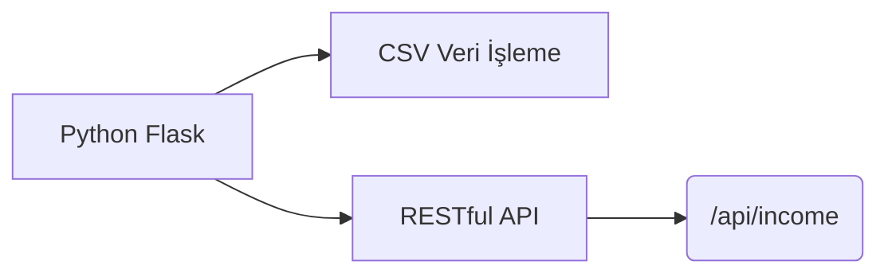
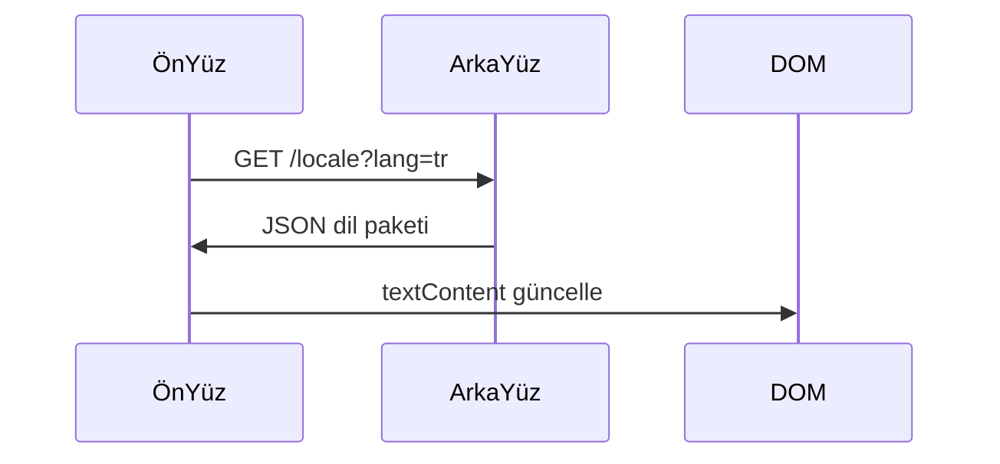
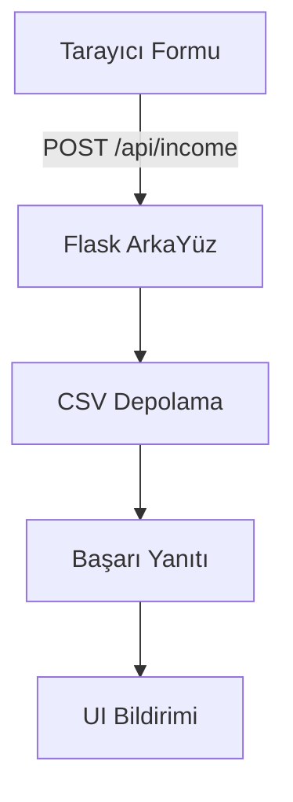

# Gelir Takip Sistemi
## Uluslararasılaştırma  
Uygulama, ana dil seviyesinde yerelleştirme ile **20 dili** desteklemektedir. Çeviri dosyaları `/locales` dizininde mevcuttur:

- [Arapça (العربية)](ar.md)  
- [Klasik Çince (文言)](zh.md)  
- [Felemenkçe](nl.md)  
- [İngilizce](README.md) (Ana dokümantasyon)  
- [Fransızca](fr.md)  
- [Almanca](de.md)  
- [Hintçe](hi.md)  
- [Endonezce](id.md)  
- [İtalyanca](it.md)  
- [Japonca](ja.md)  
- [Korece](ko.md)  
- [Lehçe](pl.md)  
- [Portekizce](pt.md)  
- [Rusça](ru.md)  
- [İspanyolca](es.md)  
- [İsveççe](sv.md)  
- [Tayca](th.md)  
- **[Türkçe](tr.md)**  
- [Ukraynaca](uk.md)  
- [Vietnamca](vi.md)  

---

# Gelir Takip Sistemi

## Proje Genel Bakışı  
CSV veri depolama ve uyarlanabilir arayüze sahip çok dilli finansal takip uygulaması. Sistem şunları sunar:

- Gerçek zamanlı gelir kaydı
- Küresel dil desteği
- Kalıcı veri yönetimi
- Tema özelleştirme
- Mobil uyumlu tasarım

## Temel Özellikler  
| Özellik | Açıklama | Teknoloji |
|---------|-------------|------------|
| **Gelir Kaydı** | Finansal girişleri ekleme, görüntüleme ve yönetme | HTML Formu + CSV |
| **Çok Dilli Arayüz** | 20 dil ana dil yerelleştirmesi | JSON i18n |
| **Veri Kalıcılığı** | Finansal kayıtların güvenli depolanması | CSV Dosyaları |
| **Koyu/Açık Mod** | Uyarlanabilir tema geçişi | CSS Değişkenleri |
| **Duyarlı Tasarım** | Tüm cihaz boyutları için optimize | CSS Medya Sorguları |
| **Kullanıcı Tercihleri** | Dil ve tema ayarlarının hatırlanması | Yerel Depolama |

---

## Teknoloji Yığını  
**Ön Yüz**  


**Arka Yüz**  


**Veri Yönetimi**  
- CSV tabanlı depolama (veritabanı gerekmez)
- Otomatik dosya oluşturma
- UTF-8 kodlama desteği

---

## Kurulum & Yapılandırma  
```bash
# 1. Bağımlılıkları yükle
pip install flask flask-cors

# 2. Uygulamayı başlat
python server.py

# 3. Sisteme eriş
http://localhost:5000
```

**Yapılandırma Seçenekleri**  
- Port değiştir: `export FLASK_PORT=8080`
- Varsayılan dili ayarla: `DEFAULT_LANG=es`

---

## Teknik Dokümantasyon

### Uluslararasılaştırma Uygulaması  
**Dosya Yapısı**  
```
/locales
  ├── en.json    # İngilizce
  ├── tr.json    # Türkçe
  └── ...        # Diğer 18 dil
```

**Uygulama Akışı**  


### Veri Akışı Mimarisi  


### Çekirdek Sistem Bileşenleri  
#### 1. Veri Sunumu  
- REST uç noktası: `GET /api/income`
- Dinamik tablo oluşturma
- Mobil optimize kart düzeni (ekranlar < 768px)

#### 2. Tema Yönetimi  
```javascript
// Tema değiştirme mantığı
function temaDegistir() {
  const koyuMu = document.body.classList.toggle('koyu-mod');
  localStorage.setItem('tema', koyuMu ? 'koyu' : 'açık');
}

// Tercihlerden başlat
const kaydedilenTema = localStorage.getItem('tema') || 
                   (matchMedia('(prefers-color-scheme: dark)').matches ? 'koyu' : 'açık');
document.body.classList.toggle('koyu-mod', kaydedilenTema === 'koyu');
```

#### 3. Duyarlı Tasarım  
**Kırılma Noktası Stratejisi**  
```css
/* Mobil öncelikli varsayılan */
.tablo-satırı { display: block; }

/* Tablet+ uyarlaması */
@media (min-width: 768px) {
  .tablo-satırı { display: table-row; }
}
```

---

## Proje Yapısı  
```
├── index.html               # Uygulama giriş noktası
├── styles.css               # Tema değişkenleriyle global stiller
├── app.js                   # Çekirdek uygulama mantığı
├── locales/                 # Dil kaynak dosyaları
│   ├── en.json              # İngilizce çeviriler
│   ├── tr.json              # Türkçe çeviriler
│   └── ...                  # Ek 18 dil
├── data/                    # Kalıcı depolama
│   └── income.csv           # Finansal kayıtlar (otomatik oluşturulur)
├── server.py                # Flask API sunucusu
└── docs/                    # Yerelleştirilmiş dokümantasyon
    ├── README.md            # İngilizce dokümantasyon
    ├── tr.md                # Türkçe dokümantasyon
    └── ...                  # 18 dilde doküman
```

---

## Geliştirme Kılavuzu  
### Yeni Dil Ekleme  
1. `/locales` içinde `[dil-kodu].json` oluşturun  
2. `/docs` içinde ilgili `[dil-kodu].md` ekleyin  
3. `app.js` dil seçicide kaydedin:  
```javascript
const DİLLER = {
  'en': 'İngilizce',
  'tr': 'Türkçe',
  // ... diğer diller
};
```

### İşlevselliği Genişletme  
**Önerilen İyileştirmeler**:  
1. Gider takip modülü  
2. Veri görselleştirme paneli  
3. Çoklu kullanıcı desteği  
4. Bulut depolama entegrasyonu  

---
> **Sistem Gereksinimleri**: Python 3.8+, Modern Tarayıcı (Chrome 88+, Firefox 84+, Safari 14+)  
> **Lisans**: AGPL-3.0 Açık Kaynak  
> **Katkı**: Yönergeler için CONTRIBUTING.md'ye bakın  