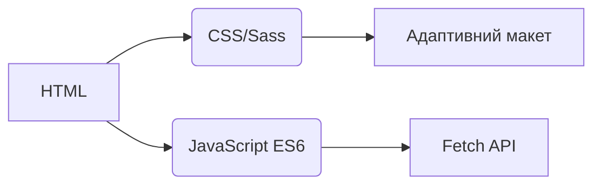
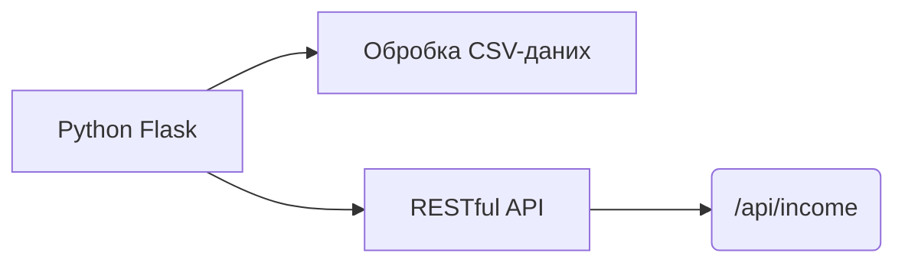
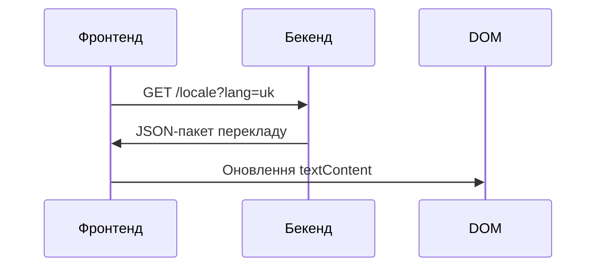
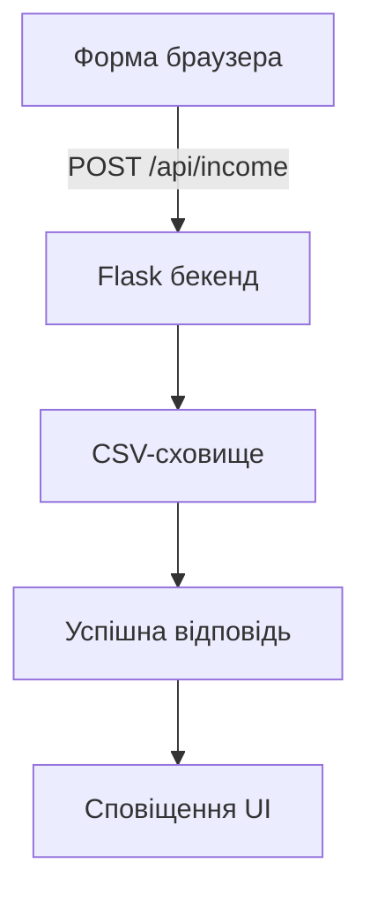

# Трекер Дохідів
## Інтернаціоналізація  
Додаток підтримує **20 мов** з локалізацією рівня носія. Файли перекладу доступні у директорії `/locales`:

- [Арабська (العربية)](ar.md)  
- [Китайська класична (文言)](zh.md)  
- [Нідерландська](nl.md)  
- [Англійська](README.md) (Основна документація)  
- [Французька](fr.md)  
- [Німецька](de.md)  
- [Гінді](hi.md)  
- [Індонезійська](id.md)  
- [Італійська](it.md)  
- [Японська](ja.md)  
- [Корейська](ko.md)  
- [Польська](pl.md)  
- [Португальська](pt.md)  
- [Російська](ru.md)  
- [Іспанська](es.md)  
- [Шведська](sv.md)  
- [Тайська](th.md)  
- [Турецька](tr.md)  
- **[Українська](uk.md)**  
- [В'єтнамська](vi.md)  

---

# Система Відстеження Дохідів

## Огляд Проекту  
Багатомовний фінансовий додаток із CSV-сховищем даних та адаптивним інтерфейсом. Система надає:

- Реєстрацію доходів у реальному часі
- Глобальну мовну підтримку
- Постійне зберігання даних
- Налаштування тем
- Адаптивний дизайн для мобільних пристроїв

## Ключові Функції  
| Функція | Опис | Технологія |
|---------|-------------|------------|
| **Реєстрація доходів** | Додавання, перегляд та керування фінансовими записами | HTML-форма + CSV |
| **Багатомовний інтерфейс** | 20 мов з нативною локалізацією | JSON i18n |
| **Сталість даних** | Безпечне зберігання фінансових записів | CSV-файли |
| **Темний/Світлий режим** | Адаптивне перемикання тем | CSS-змінні |
| **Адаптивний дизайн** | Оптимізовано для всіх розмірів пристроїв | CSS Media Queries |
| **Налаштування користувача** | Збереження мови та теми | LocalStorage |

---

## Технологічний Стек  
**Фронтенд**  


**Бекенд**  


**Управління даними**  
- Сховище на основі CSV (база даних не потрібна)
- Автоматичне створення файлів
- Підтримка кодування UTF-8

---

## Встановлення та Налаштування  
```bash
# 1. Встановити залежності
pip install flask flask-cors

# 2. Запустити додаток
python server.py

# 3. Доступ до системи
http://localhost:5000
```

**Параметри конфігурації**  
- Змінити порт: `export FLASK_PORT=8080`
- Встановити мову за замовчуванням: `DEFAULT_LANG=es`

---

## Технічна Документація

### Реалізація інтернаціоналізації  
**Структура файлів**  
```
/locales
  ├── en.json    # Англійська
  ├── uk.json    # Українська
  └── ...        # 18 інших мов
```

**Робочий процес реалізації**  


### Архітектура потоку даних  


### Основні компоненти системи  
#### 1. Відображення даних  
- REST-ендпоінт: `GET /api/income`
- Динамічне створення таблиць
- Мобільна карткова розмітка (екрани < 768px)

#### 2. Управління темами  
```javascript
// Логіка перемикання теми
function перемкнутиТему() {
  const темна = document.body.classList.toggle('темна-тема');
  localStorage.setItem('тема', темна ? 'темна' : 'світла');
}

// Ініціалізація з налаштувань
const збереженаТема = localStorage.getItem('тема') || 
                   (matchMedia('(prefers-color-scheme: dark)').matches ? 'темна' : 'світла');
document.body.classList.toggle('темна-тема', збереженаТема === 'темна');
```

#### 3. Адаптивний дизайн  
**Стратегія брейкпоінтів**  
```css
/* Мобільний підхід за замовчуванням */
.рядок-таблиці { display: block; }

/* Адаптація для планшетів+ */
@media (min-width: 768px) {
  .рядок-таблиці { display: table-row; }
}
```

---

## Структура Проекту  
```
├── index.html               # Вхідна точка додатку
├── styles.css               # Глобальні стилі зі змінними теми
├── app.js                   # Основна логіка додатку
├── locales/                 # Файли мовних ресурсів
│   ├── en.json              # Англійські переклади
│   ├── uk.json              # Українські переклади
│   └── ...                  # 18 додаткових мов
├── data/                    # Постійне сховище
│   └── income.csv           # Фінансові записи (створюється автоматично)
├── server.py                # Flask API-сервер
└── docs/                    # Локалізована документація
    ├── README.md            # Англійська документація
    ├── uk.md                # Українська документація
    └── ...                  # Документація 18 мовами
```

---

## Посібник Розробника  
### Додавання нових мов  
1. Створити `[код-мови].json` у `/locales`
2. Додати відповідний `[код-мови].md` у `/docs`
3. Зареєструвати у виборі мов `app.js`:
```javascript
const МОВИ = {
  'en': 'Англійська',
  'uk': 'Українська',
  // ... інші мови
};
```

### Розширення функціональності  
**Рекомендовані покращення**:  
1. Модуль відстеження витрат  
2. Панель візуалізації даних  
3. Підтримка багатокористувацького режиму  
4. Інтеграція з хмарним сховищем  

---
> **Системні вимоги**: Python 3.8+, Сучасний браузер (Chrome 88+, Firefox 84+, Safari 14+)  
> **Ліцензія**: AGPL-3.0 Open Source  
> **Внесок**: Див. CONTRIBUTING.md для керівництва  