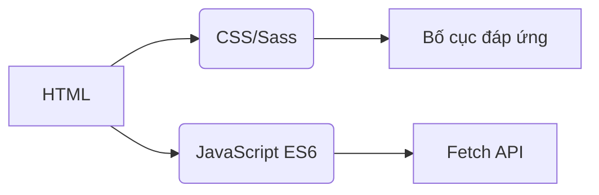
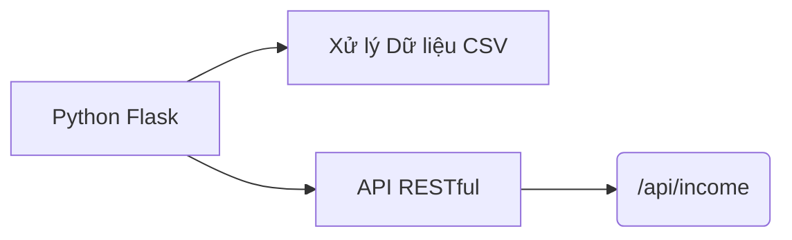
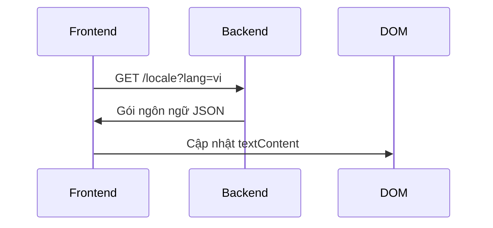
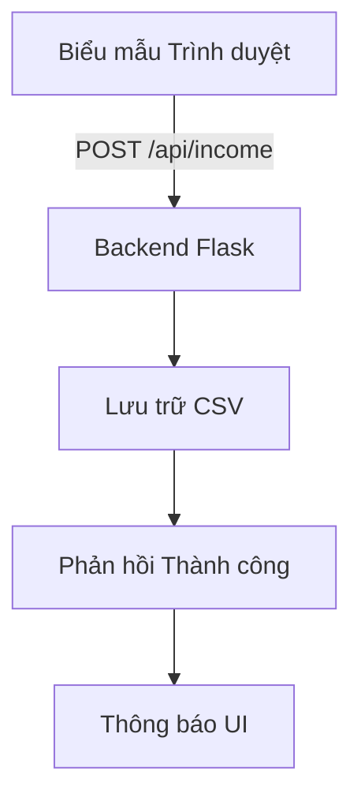

# Trình Theo Dõi Thu Nhập
## Quốc tế hóa  
Ứng dụng hỗ trợ **20 ngôn ngữ** với bản địa hóa cấp độ bản ngữ. Tệp dịch có sẵn trong thư mục `/locales`:

- [Tiếng Ả Rập (العربية)](ar.md)  
- [Tiếng Trung Cổ điển (文言)](zh.md)  
- [Tiếng Hà Lan](nl.md)  
- [Tiếng Anh](README.md) (Tài liệu chính)  
- [Tiếng Pháp](fr.md)  
- [Tiếng Đức](de.md)  
- [Tiếng Hindi](hi.md)  
- [Tiếng Indonesia](id.md)  
- [Tiếng Ý](it.md)  
- [Tiếng Nhật](ja.md)  
- [Tiếng Hàn](ko.md)  
- [Tiếng Ba Lan](pl.md)  
- [Tiếng Bồ Đào Nha](pt.md)  
- [Tiếng Nga](ru.md)  
- [Tiếng Tây Ban Nha](es.md)  
- [Tiếng Thụy Điển](sv.md)  
- [Tiếng Thái](th.md)  
- [Tiếng Thổ Nhĩ Kỳ](tr.md)  
- [Tiếng Ukraina](uk.md)  
- **[Tiếng Việt](vi.md)**  

---

# Hệ Thống Theo Dõi Thu Nhập

## Tổng quan Dự án  
Ứng dụng theo dõi tài chính đa ngôn ngữ với lưu trữ dữ liệu CSV và giao diện thích ứng. Hệ thống cung cấp:

- Ghi nhận thu nhập thời gian thực
- Hỗ trợ ngôn ngữ toàn cầu
- Quản lý dữ liệu liên tục
- Tùy chỉnh chủ đề
- Thiết kế đáp ứng cho thiết bị di động

## Tính năng Chính  
| Tính năng | Mô tả | Công nghệ |
|---------|-------------|------------|
| **Ghi nhận thu nhập** | Thêm, xem và quản lý mục tài chính | Biểu mẫu HTML + CSV |
| **Giao diện đa ngôn ngữ** | 20 ngôn ngữ với bản địa hóa gốc | JSON i18n |
| **Duy trì dữ liệu** | Lưu trữ an toàn hồ sơ tài chính | Tệp CSV |
| **Chế độ Tối/Sáng** | Chuyển đổi chủ đề thích ứng | Biến CSS |
| **Thiết kế đáp ứng** | Tối ưu cho mọi kích thước thiết bị | Truy vấn CSS Media |
| **Tùy chọn Người dùng** | Ghi nhớ cài đặt ngôn ngữ và chủ đề | LocalStorage |

---

## Công nghệ Sử dụng  
**Frontend**  


**Backend**  


**Quản lý Dữ liệu**  
- Lưu trữ dựa trên CSV (không cần cơ sở dữ liệu)
- Tạo tệp tự động
- Hỗ trợ mã hóa UTF-8

---

## Cài đặt & Thiết lập  
```bash
# 1. Cài đặt phụ thuộc
pip install flask flask-cors

# 2. Khởi động ứng dụng
python server.py

# 3. Truy cập hệ thống
http://localhost:5000
```

**Tùy chọn Cấu hình**  
- Thay đổi cổng: `export FLASK_PORT=8080`
- Đặt ngôn ngữ mặc định: `DEFAULT_LANG=es`

---

## Tài liệu Kỹ thuật

### Triển khai Quốc tế hóa  
**Cấu trúc Tệp**  
```
/locales
  ├── en.json    # Tiếng Anh
  ├── vi.json    # Tiếng Việt
  └── ...        # 18 ngôn ngữ khác
```

**Quy trình Triển khai**  


### Kiến trúc Luồng Dữ liệu  


### Thành phần Hệ thống Cốt lõi  
#### 1. Trình bày Dữ liệu  
- Điểm cuối REST: `GET /api/income`
- Tạo bảng động
- Bố cục thẻ tối ưu cho di động (màn hình < 768px)

#### 2. Quản lý Chủ đề  
```javascript
// Logic chuyển đổi chủ đề
function chuyenDoiChuDe() {
  const isToi = document.body.classList.toggle('che-do-toi');
  localStorage.setItem('chuDe', isToi ? 'toi' : 'sang');
}

// Khởi tạo từ tùy chọn
const chuDeDaLuu = localStorage.getItem('chuDe') || 
                   (matchMedia('(prefers-color-scheme: dark)').matches ? 'toi' : 'sang');
document.body.classList.toggle('che-do-toi', chuDeDaLuu === 'toi');
```

#### 3. Thiết kế Đáp ứng  
**Chiến lược Điểm ngắt**  
```css
/* Mặc định mobile-first */
.hang-bang { display: block; }

/* Tối ưu cho máy tính bảng+ */
@media (min-width: 768px) {
  .hang-bang { display: table-row; }
}
```

---

## Cấu trúc Dự án  
```
├── index.html               # Điểm vào ứng dụng
├── styles.css               # Kiểu toàn cục với biến chủ đề
├── app.js                   # Logic ứng dụng cốt lõi
├── locales/                 # Tệp tài nguyên ngôn ngữ
│   ├── en.json              # Bản dịch tiếng Anh
│   ├── vi.json              # Bản dịch tiếng Việt
│   └── ...                  # 18 ngôn ngữ bổ sung
├── data/                    # Lưu trữ liên tục
│   └── income.csv           # Hồ sơ tài chính (tạo tự động)
├── server.py                # Máy chủ API Flask
└── docs/                    # Tài liệu địa phương hóa
    ├── README.md            # Tài liệu tiếng Anh
    ├── vi.md                # Tài liệu tiếng Việt
    └── ...                  # Tài liệu 18 ngôn ngữ
```

---

## Hướng dẫn Phát triển  
### Thêm Ngôn ngữ Mới  
1. Tạo `[mã-ngôn-ngữ].json` trong `/locales`
2. Thêm `[mã-ngôn-ngữ].md` tương ứng trong `/docs`
3. Đăng ký trong bộ chọn ngôn ngữ `app.js`:
```javascript
const NGON_NGU = {
  'en': 'Tiếng Anh',
  'vi': 'Tiếng Việt',
  // ... ngôn ngữ khác
};
```

### Mở rộng Chức năng  
**Cải tiến Đề xuất**:  
1. Mô-đun theo dõi chi phí  
2. Bảng điều khiển trực quan hóa dữ liệu  
3. Hỗ trợ đa người dùng  
4. Tích hợp lưu trữ đám mây  

---
> **Yêu cầu Hệ thống**: Python 3.8+, Trình duyệt Hiện đại (Chrome 88+, Firefox 84+, Safari 14+)  
> **Giấy phép**: AGPL-3.0 Nguồn mở  
> **Đóng góp**: Xem CONTRIBUTING.md để biết hướng dẫn  