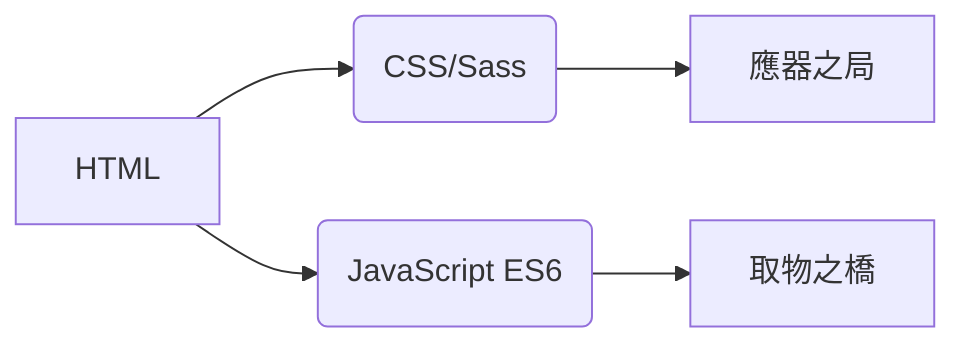
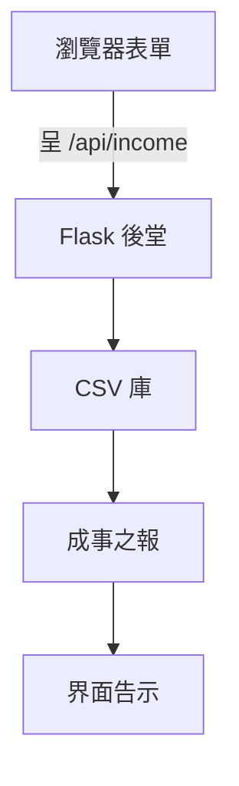

# 收支録
## 萬國言譯
本器通曉**二十方言語**，譯文皆合本土之俗。譯籍存於`/locales`庫中：  

- [大食言（العربية）](ar.md)  
- [漢文（文言）](zh.md)  
- [荷蘭言（Nederlands）](nl.md)  
- **[英言](README.md)**（主文牘）  
- [法言（Français）](fr.md)  
- [德意志言（Deutsch）](de.md)  
- [天竺言（हिन्दी）](hi.md)  
- [爪哇言（Bahasa Indonesia）](id.md)  
- [意大利言（Italiano）](it.md)  
- [日文（日本語）](ja.md)  
- [朝鮮言（한국어）](ko.md)  
- [波蘭言（Polski）](pl.md)  
- [葡萄言（Português）](pt.md)  
- [露西亞言（Русский）](ru.md)  
- [西班牙言（Español）](es.md)  
- [瑞典言（Svenska）](sv.md)  
- [暹羅言（ไทย）](th.md)  
- [突厥言（Türkçe）](tr.md)  
- [烏克蘭言（Українська）](uk.md)  
- [安南言（Tiếng Việt）](vi.md)  

---

# 度支録籍

## 綱要
多言語財貨紀録之器，以CSV儲數，界面隨器而變。其能如下：  

- 實時録入資財  
- 萬國言語皆備  
- 數籍久存不滅  
- 可易明暗之貌  
- 應手機之變局  

## 要術  
| 術能 | 述要 | 技藝 |  
|-------|-------|--------|  
| **記財** | 增、覽、理資財條目 | HTML 表單 + CSV |  
| **多言語** | 二十方俗語譯文 | JSON i18n |  
| **數存** | 資財録籍固守 | CSV 文牘 |  
| **明暗易容** | 隨境變色之法 | CSS 變數 |  
| **應器之變** | 萬般器械皆宜 | CSS 量器 |  
| **用者所好** | 記言語色貌之選 | LocalStorage |  

---

## 技藝棧
**前庭**  


**後堂**  
```mermaid
graph LR
己[Python Flask] --> 庚[CSV 理數]
己 --> 辛[RESTful 橋]
辛 --> 壬[/api/income]
```

**理數之法**  
- 以CSV爲庫（無需庋藏）  
- 文牘自生  
- 通UTF-8字碼  

---

## 立器之法
```bash
# 一、置所需
pip install flask flask-cors

# 二、起器
python server.py

# 三、登堂
http://localhost:5000
```

**變通之法**  
- 易埠：`export FLASK_PORT=8080`  
- 定言語：`DEFAULT_LANG=es`  

---

## 技藝文牘

### 萬國言譯之法
**文牘之序**  
```
/locales
  ├── en.json    # 英言
  ├── zh.json    # 漢文
  └── ...        # 餘十八方言語
```

**行術之序**  
```mermaid
sequenceDiagram
    前庭->>後堂： 求 /locale?lang=es
    後堂->>前庭： 饋 JSON 言語包
    前庭->>界面： 更字
```

### 數流之構


### 樞機之部
#### 一、顯數
- REST 端：`GET /api/income`  
- 動表自生  
- 應手機之牌局（小於768px之屏）  

#### 二、色貌之治
```javascript
// 易色之法
function 易色() {
  暗否 = document.body.classList.toggle('暗色');
  localStorage.setItem('色貌', 暗否 ? '暗' : '明');
}

// 依所好始立
存色 = localStorage.getItem('色貌') || 
       (matchMedia('(prefers-color-scheme: 暗)').matches ? '暗' : '明');
document.body.classList.toggle('暗色', 存色 === '暗');
```

#### 三、應器之局
**斷點之策**  
```css
/* 手機爲本 */
.表行 { 顯法: 塊; }

/* 平板以上 */
@media (min-width: 768px) {
  .表行 { 顯法: 表行; }
}
```

---

## 文牘之序
```
├── index.html                # 登堂之門
├── styles.css                # 總體色貌並變數
├── app.js                    # 樞紐理數之法
├── locales/                  # 言語文籍
│   ├── ar.json               # 大食言譯
│   ├── zh.json               # 漢文文言譯
│   └── ...                   # 餘十八譯
├── data/                     # 數庫
│   └── income.csv            # 資財録（自生）
├── server.py                 # Flask 侍器
└── docs/                     # 方言語牘
    ├── README.md             # 英言文牘
    ├── ar.md                 # 大食文牘
    └── ...                   # 餘十八牘
```

---

## 開物之導
### 增新言語
一、於`/locales`製`[言語符].json`  
二、於`/docs`添`[言語符].md`  
三、於`app.js`言語選器注籍：  
```javascript
const 言語集 = {
  'en': '英言',
  'zh': '漢文（文言）',
  // ... 餘言語
};
```

### 拓能之議
**可增之能**：  
一、用度紀録之部  
二、數象瞭望臺  
三、衆人共用之制  
四、雲庫接引之法  

---
> **器需**：Python 3.8+，當世瀏覽器（Chrome 88+、Firefox 84+、Safari 14+）  
> **契書**：AGPL-3.0 開物之契  
> **共撰**：見 CONTRIBUTING.md 之規  
